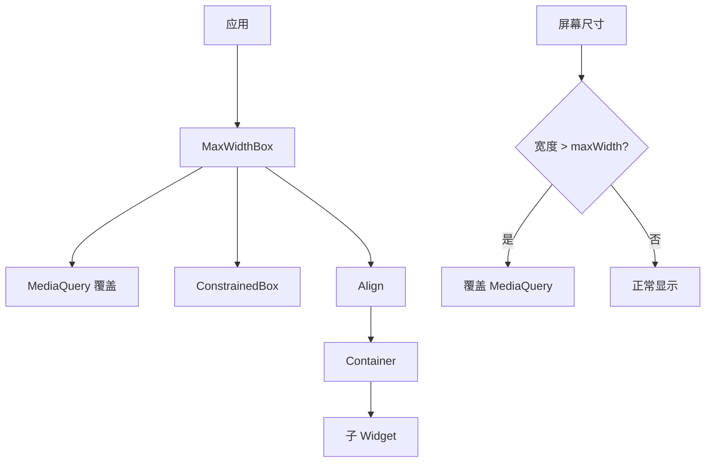
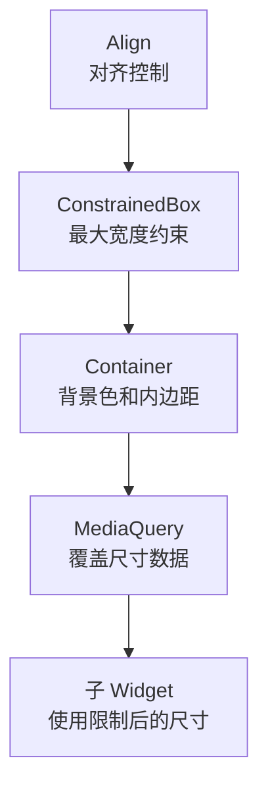

# MaxWidthBox 代码讲解

## 概述

`MaxWidthBox` 是响应式框架中用于限制子 Widget 最大宽度的 Widget。它通过覆盖 `MediaQuery` 和应用 `BoxConstraints` 来实现最大宽度限制，同时支持对齐、内边距和背景色等样式定制。当屏幕宽度超过指定的最大宽度时，内容会被限制在最大宽度内，并根据对齐方式居中或靠左/靠右显示。

### 核心职责

1. **最大宽度限制**：限制子 Widget 的最大宽度，防止内容在大屏幕上过度拉伸
2. **MediaQuery 覆盖**：当宽度超过最大宽度时，覆盖 `MediaQuery` 的尺寸信息
3. **对齐控制**：支持左对齐、居中、右对齐等多种对齐方式
4. **样式定制**：支持内边距和背景色设置

### 在响应式框架中的位置

`MaxWidthBox` 位于响应式布局工具层，用于内容宽度控制：



**数据流向**：

1. `MaxWidthBox` 获取当前屏幕尺寸（通过 `MediaQuery`）
2. 如果屏幕宽度超过 `maxWidth`，计算新的尺寸（考虑 padding）
3. 覆盖 `MediaQuery` 数据，使子 Widget 认为屏幕更小
4. 应用 `BoxConstraints` 限制最大宽度
5. 根据对齐方式显示内容

### 与相关类的关系

- **MediaQuery**：Flutter 原生 Widget，提供屏幕尺寸等信息
- **ConstrainedBox**：Flutter 原生 Widget，应用布局约束
- **Align**：Flutter 原生 Widget，控制对齐方式
- **Container**：Flutter 原生 Widget，提供样式支持

## 类定义和特性

### 类声明

```dart
class MaxWidthBox extends StatelessWidget
```

`MaxWidthBox` 继承自 `StatelessWidget`，是一个无状态的 Widget。

**设计特点**：

- **无状态设计**：每次构建时重新计算尺寸，确保响应式更新
- **MediaQuery 覆盖**：通过覆盖 `MediaQuery` 实现尺寸限制
- **约束应用**：通过 `ConstrainedBox` 应用最大宽度约束

## 属性详解

### maxWidth

```dart
final double? maxWidth;
```

**作用**：子 Widget 的最大宽度限制。

**说明**：

- 类型为 `double?`，可以为 `null`
- 如果为 `null`，不应用最大宽度限制
- 当屏幕宽度超过此值时，内容会被限制在此宽度内
- 实际可用宽度会减去 `padding` 的水平部分

**使用场景**：

- 限制内容在大屏幕上的最大宽度
- 保持内容的可读性和美观性
- 实现响应式布局

### child

```dart
final Widget child;
```

**作用**：要限制宽度的子 Widget。

**说明**：这是必需的参数，指定需要应用最大宽度限制的 Widget。

### alignment

```dart
final AlignmentGeometry alignment;
```

**作用**：子 Widget 的对齐方式。

**说明**：

- 类型为 `AlignmentGeometry`，支持多种对齐方式
- 默认值为 `Alignment.topCenter`（顶部居中）
- 当内容宽度小于屏幕宽度时，根据此对齐方式定位

**常用对齐方式**：

- `Alignment.topCenter`：顶部居中（默认）
- `Alignment.topLeft`：顶部左对齐
- `Alignment.topRight`：顶部右对齐
- `Alignment.center`：居中
- `Alignment.centerLeft`：居中左对齐
- `Alignment.centerRight`：居中右对齐

**设计意图**：应用内容通常顶部对齐，因此默认使用 `topCenter`。

### padding

```dart
final EdgeInsets? padding;
```

**作用**：内边距，在内容和容器边缘之间添加空间。

**说明**：

- 类型为 `EdgeInsets?`，可以为 `null`
- 如果为 `null`，不添加内边距
- 内边距会影响可用宽度和高度计算
- 在计算 `MediaQuery` 覆盖时，会减去 padding 的尺寸

**使用场景**：

- 在内容和屏幕边缘之间添加间距
- 改善视觉效果和可读性

### backgroundColor

```dart
final Color? backgroundColor;
```

**作用**：容器的背景色。

**说明**：

- 类型为 `Color?`，可以为 `null`
- 如果为 `null`，不设置背景色（透明）
- 通过 `Container` 的 `color` 属性应用

**使用场景**：

- 为内容区域添加背景色
- 区分内容区域和背景

## 构造函数

```dart
const MaxWidthBox({
  super.key,
  required this.maxWidth,
  required this.child,
  this.alignment = Alignment.topCenter,
  this.padding,
  this.backgroundColor,
});
```

**参数说明**：

- `key`：Widget 的键，用于 Widget 树中的识别
- `maxWidth`：必需的最大宽度
- `child`：必需的子 Widget
- `alignment`：对齐方式，默认为 `Alignment.topCenter`
- `padding`：可选的内边距
- `backgroundColor`：可选的背景色

**设计特点**：

- 使用 `const` 构造函数，支持编译时常量
- 参数命名清晰，易于理解

## build() 方法详解

```dart
@override
Widget build(BuildContext context) {
  MediaQueryData mediaQuery = MediaQuery.of(context);

  if (maxWidth != null) {
    if (mediaQuery.size.width > maxWidth!) {
      mediaQuery = mediaQuery.copyWith(
          size: Size(maxWidth! - (padding?.horizontal ?? 0),
              mediaQuery.size.height - (padding?.vertical ?? 0)));
    }
  }

  return Align(
    alignment: alignment,
    child: ConstrainedBox(
      constraints: BoxConstraints(maxWidth: maxWidth ?? double.infinity),
      child: Container(
        color: backgroundColor,
        padding: padding,
        child: MediaQuery(
          data: mediaQuery,
          child: child,
        ),
      ),
    ),
  );
}
```

### 实现逻辑

1. **获取 MediaQuery**：从上下文获取当前的 `MediaQueryData`

2. **检查并覆盖尺寸**：
   - 如果 `maxWidth` 不为 `null` 且屏幕宽度超过 `maxWidth`
   - 计算新的尺寸：
     - 宽度：`maxWidth - padding.horizontal`
     - 高度：`mediaQuery.size.height - padding.vertical`
   - 创建新的 `MediaQueryData`，覆盖尺寸信息

3. **构建 Widget 树**：
   - `Align`：根据 `alignment` 对齐内容
   - `ConstrainedBox`：应用最大宽度约束
   - `Container`：应用背景色和内边距
   - `MediaQuery`：覆盖 `MediaQueryData`，使子 Widget 使用新的尺寸

### MediaQuery 覆盖机制

**为什么需要覆盖 MediaQuery**：

- 子 Widget 可能使用 `MediaQuery.of(context).size.width` 获取屏幕宽度
- 如果不覆盖，子 Widget 仍然认为屏幕很宽
- 覆盖后，子 Widget 会使用限制后的宽度进行计算

**覆盖逻辑**：

```dart
if (mediaQuery.size.width > maxWidth!) {
  mediaQuery = mediaQuery.copyWith(
    size: Size(
      maxWidth! - (padding?.horizontal ?? 0),
      mediaQuery.size.height - (padding?.vertical ?? 0)
    ),
  );
}
```

- 只有当屏幕宽度超过 `maxWidth` 时才覆盖
- 宽度减去 padding 的水平部分（left + right）
- 高度减去 padding 的垂直部分（top + bottom）

### 约束应用

通过 `ConstrainedBox` 应用最大宽度约束：

```dart
ConstrainedBox(
  constraints: BoxConstraints(maxWidth: maxWidth ?? double.infinity),
  child: ...
)
```

- 如果 `maxWidth` 不为 `null`，限制最大宽度
- 如果 `maxWidth` 为 `null`，不限制（`double.infinity`）

### Widget 树结构



## 使用示例

### 基本使用

```dart
MaxWidthBox(
  maxWidth: 1200,
  child: ContentWidget(),
)
```

### 响应式内容宽度限制

```dart
MaxWidthBox(
  maxWidth: ResponsiveValue<double>(
    context,
    defaultValue: 600,
    conditionalValues: [
      Condition.equals(name: DESKTOP, value: 1200),
      Condition.equals(name: TABLET, value: 800),
      Condition.equals(name: MOBILE, value: double.infinity),
    ],
  ).value,
  child: ArticleContent(),
)
```

### 居中对齐

```dart
MaxWidthBox(
  maxWidth: 1200,
  alignment: Alignment.center,
  child: ContentWidget(),
)
```

### 添加内边距和背景色

```dart
MaxWidthBox(
  maxWidth: 1200,
  padding: EdgeInsets.all(16),
  backgroundColor: Colors.white,
  child: ContentWidget(),
)
```

### 响应式文章布局

```dart
MaxWidthBox(
  maxWidth: 800,
  alignment: Alignment.topCenter,
  padding: EdgeInsets.symmetric(horizontal: 24, vertical: 16),
  backgroundColor: Colors.white,
  child: Column(
    children: [
      ArticleHeader(),
      ArticleBody(),
      ArticleFooter(),
    ],
  ),
)
```

### 响应式卡片容器

```dart
MaxWidthBox(
  maxWidth: ResponsiveValue<double>(
    context,
    defaultValue: 400,
    conditionalValues: [
      Condition.largerThan(name: DESKTOP, value: 600),
      Condition.equals(name: TABLET, value: 500),
    ],
  ).value,
  alignment: Alignment.center,
  padding: EdgeInsets.all(16),
  backgroundColor: Colors.blue.shade50,
  child: CardContent(),
)
```

### 表单容器

```dart
MaxWidthBox(
  maxWidth: 600,
  alignment: Alignment.center,
  padding: EdgeInsets.all(24),
  backgroundColor: Colors.white,
  child: Form(
    child: Column(
      children: [
        TextField(...),
        TextField(...),
        ElevatedButton(...),
      ],
    ),
  ),
)
```

## 设计模式和最佳实践

### 包装器模式

`MaxWidthBox` 采用了包装器模式：

- **封装复杂性**：隐藏了 MediaQuery 覆盖和约束应用的复杂性
- **简化 API**：提供简单的参数接口
- **保持兼容性**：完全兼容 Flutter 的布局系统

### 最佳实践建议

1. **合理设置最大宽度**：根据内容类型和设备类型设置合理的最大宽度

2. **使用响应式值**：结合 `ResponsiveValue` 为不同设备设置不同的最大宽度

3. **考虑内边距**：设置内边距时，注意可用宽度会相应减少

4. **对齐方式选择**：
   - 内容通常使用 `topCenter` 或 `center`
   - 表单通常使用 `center`
   - 列表通常使用 `topLeft` 或 `topCenter`

5. **性能考虑**：
   - `MaxWidthBox` 是轻量级 Widget，性能影响很小
   - MediaQuery 覆盖不会触发额外的重建

6. **可访问性**：确保背景色和内容有足够的对比度

## 常见使用场景

### 场景 1：文章内容限制

```dart
MaxWidthBox(
  maxWidth: 800,
  alignment: Alignment.topCenter,
  padding: EdgeInsets.symmetric(horizontal: 24),
  child: ArticleContent(),
)
```

### 场景 2：响应式表单

```dart
MaxWidthBox(
  maxWidth: ResponsiveValue<double>(
    context,
    defaultValue: 400,
    conditionalValues: [
      Condition.equals(name: DESKTOP, value: 600),
      Condition.equals(name: TABLET, value: 500),
    ],
  ).value,
  alignment: Alignment.center,
  child: LoginForm(),
)
```

### 场景 3：卡片网格容器

```dart
MaxWidthBox(
  maxWidth: 1200,
  alignment: Alignment.center,
  padding: EdgeInsets.all(16),
  child: GridView(...),
)
```

## 总结

`MaxWidthBox` 是响应式框架中用于限制内容最大宽度的便捷工具，提供了：

1. **最大宽度限制**：防止内容在大屏幕上过度拉伸
2. **MediaQuery 覆盖**：使子 Widget 使用限制后的尺寸
3. **对齐控制**：支持多种对齐方式
4. **样式定制**：支持内边距和背景色
5. **易于使用**：简单的 API，易于理解和使用

理解 `MaxWidthBox` 的设计和使用方法，有助于更好地构建响应式 Flutter 应用，实现内容宽度控制和美观的布局效果。
