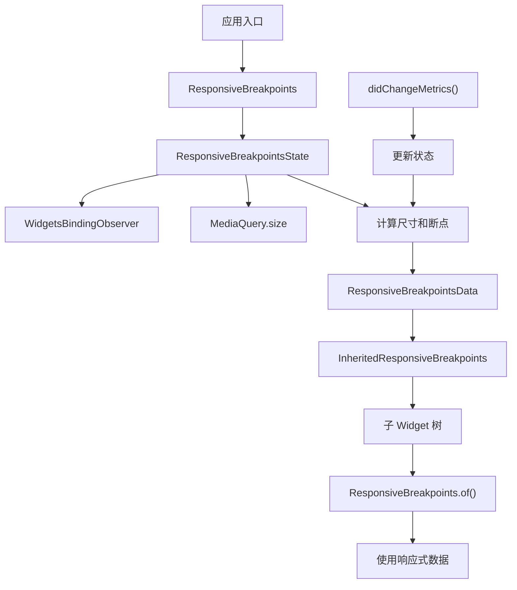
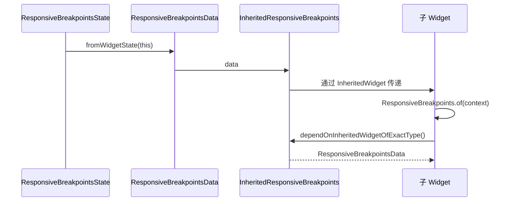
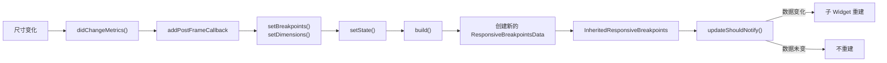

# ResponsiveBreakpoints 代码讲解

## 概述

`ResponsiveBreakpoints` 是响应式框架的核心组件，负责管理屏幕断点、监听设备尺寸变化，并向子 Widget 提供响应式数据。它通过 `InheritedWidget` 模式将响应式信息传递给整个 Widget 树。

### 核心职责

1. **断点管理**：根据屏幕宽度匹配对应的断点
2. **尺寸监听**：监听窗口尺寸变化并自动更新状态
3. **方向检测**：支持横竖屏切换，可配置不同的横屏断点
4. **平台适配**：识别运行平台（Web、iOS、Android 等）
5. **数据提供**：通过 `InheritedWidget` 向子 Widget 提供响应式数据

### 架构图



## ResponsiveBreakpoints 类详解

### 类定义

```dart
class ResponsiveBreakpoints extends StatefulWidget
```

`ResponsiveBreakpoints` 继承自 `StatefulWidget`，是一个有状态的 Widget，用于管理响应式断点的状态。

### 属性说明

#### breakpoints

```dart
final List<Breakpoint> breakpoints;
```

**作用**：竖屏模式下的断点列表。

**说明**：这是必需的参数，定义了不同屏幕宽度范围对应的断点。每个 `Breakpoint` 包含：

- `start`：断点起始宽度
- `end`：断点结束宽度
- `name`：断点名称（可选，如 "MOBILE"、"TABLET"、"DESKTOP"）
- `data`：附加数据（可选）

#### breakpointsLandscape

```dart
final List<Breakpoint>? breakpointsLandscape;
```

**作用**：横屏模式下的断点列表（可选）。

**说明**：

- 当设备处于横屏且平台支持横屏时，使用此断点列表
- 如果为 `null`，横屏时仍使用 `breakpoints`
- 仅在支持方向切换的平台（默认：Android、iOS、Fuchsia）上生效

**使用场景**：当横竖屏需要不同的布局策略时，可以定义不同的断点。

#### landscapePlatforms

```dart
final List<ResponsiveTargetPlatform>? landscapePlatforms;
```

**作用**：覆盖支持横屏模式的平台列表。

**说明**：

- 默认情况下，只有移动平台（Android、iOS、Fuchsia）支持横屏模式
- 通过此参数可以自定义哪些平台启用横屏断点
- 主要用于特殊需求或未来兼容性

#### useShortestSide

```dart
final bool useShortestSide;
```

**作用**：基于屏幕最短边计算响应式尺寸，而非实际方向。

**说明**：

- 当 `true` 时，`screenWidth` 始终使用宽度和高度中的较小值
- 当 `false` 时，`screenWidth` 使用实际窗口宽度

**使用场景**：

- 避免滚动屏幕，基于宽高比而非方向来布局
- 横竖屏切换时，尺寸单位保持一致
- 只需根据方向调整少量 Widget 的硬编码尺寸

**示例**：

- 竖屏：宽度 375，高度 812 → `screenWidth = 375`（如果 `useShortestSide = true`）
- 横屏：宽度 812，高度 375 → `screenWidth = 375`（如果 `useShortestSide = true`）

#### debugLog

```dart
final bool debugLog;
```

**作用**：是否在控制台打印断点可视化信息。

**说明**：启用后会在 `initState` 时打印断点范围，方便调试。

### 构造函数

```dart
const ResponsiveBreakpoints({
  super.key,
  required this.child,
  required this.breakpoints,
  this.breakpointsLandscape,
  this.landscapePlatforms,
  this.useShortestSide = false,
  this.debugLog = false,
});
```

**参数说明**：

- `child`：子 Widget，将获得响应式能力
- `breakpoints`：必需的断点列表
- 其他参数均为可选，有默认值

### 静态方法

#### builder() 方法

```dart
static Widget builder({
  required Widget child,
  required List<Breakpoint> breakpoints,
  List<Breakpoint>? breakpointsLandscape,
  List<ResponsiveTargetPlatform>? landscapePlatforms,
  bool useShortestSide = false,
  bool debugLog = false,
})
```

**作用**：便捷的工厂方法，用于创建 `ResponsiveBreakpoints` 实例。

**使用场景**：提供命名参数，代码可读性更好。

#### of() 方法

```dart
static ResponsiveBreakpointsData of(BuildContext context)
```

**作用**：从 Widget 树中获取最近的 `ResponsiveBreakpointsData`。

**实现原理**：

1. 通过 `dependOnInheritedWidgetOfExactType<InheritedResponsiveBreakpoints>()` 查找 `InheritedWidget`
2. 如果找到，返回其 `data` 属性
3. 如果未找到，抛出 `FlutterError`，提示需要在 Widget 树中添加 `ResponsiveBreakpoints`

**使用示例**：

```dart
final responsive = ResponsiveBreakpoints.of(context);
if (responsive.isMobile) {
  // 移动端布局
} else {
  // 桌面端布局
}
```

**注意事项**：

- 必须在 `ResponsiveBreakpoints` 的子 Widget 树中调用
- 调用后会建立依赖关系，当响应式数据变化时，该 Widget 会自动重建

## ResponsiveBreakpointsState 类详解

### 类定义

```dart
class ResponsiveBreakpointsState extends State<ResponsiveBreakpoints>
    with WidgetsBindingObserver
```

**继承关系**：

- 继承 `State<ResponsiveBreakpoints>`
- 混入 `WidgetsBindingObserver`，用于监听系统事件（如窗口尺寸变化）

### 状态变量

#### 窗口尺寸

```dart
double windowWidth = 0;
double getWindowWidth() {
  return MediaQuery.of(context).size.width;
}

double windowHeight = 0;
double getWindowHeight() {
  return MediaQuery.of(context).size.height;
}
```

**说明**：

- `windowWidth` 和 `windowHeight` 存储从 `MediaQuery` 获取的原始窗口尺寸
- 通过 getter 方法获取，确保始终获取最新值

#### 计算后的屏幕尺寸

```dart
double screenWidth = 0;
double getScreenWidth() {
  double widthCalc = useShortestSide
      ? (windowWidth < windowHeight ? windowWidth : windowHeight)
      : windowWidth;
  return widthCalc;
}

double screenHeight = 0;
double getScreenHeight() {
  double heightCalc = useShortestSide
      ? (windowWidth < windowHeight ? windowHeight : windowWidth)
      : windowHeight;
  return heightCalc;
}
```

**说明**：

- `screenWidth` 和 `screenHeight` 是用于断点匹配的计算尺寸
- 当 `useShortestSide = true` 时：
  - `screenWidth` = min(windowWidth, windowHeight)
  - `screenHeight` = max(windowWidth, windowHeight)
- 当 `useShortestSide = false` 时：
  - `screenWidth` = windowWidth
  - `screenHeight` = windowHeight

**设计意图**：允许开发者基于屏幕的宽高比而非方向来设计布局。

#### 断点相关

```dart
Breakpoint breakpoint = const Breakpoint(start: 0, end: 0);
List<Breakpoint> breakpoints = [];
```

**说明**：

- `breakpoint`：当前匹配的断点
- `breakpoints`：当前激活的断点列表（根据方向和平台筛选后）

### 方向检测

```dart
Orientation get orientation => (windowWidth > windowHeight)
    ? Orientation.landscape
    : Orientation.portrait;
```

**说明**：根据窗口宽高比判断方向，而非设备的物理方向。

**注意**：在 Flutter 中，`MediaQuery.orientation` 也是基于宽高比计算的，不是真实的设备方向。

### 平台检测

```dart
static const List<ResponsiveTargetPlatform> _landscapePlatforms = [
  ResponsiveTargetPlatform.iOS,
  ResponsiveTargetPlatform.android,
  ResponsiveTargetPlatform.fuchsia,
];

ResponsiveTargetPlatform? platform;

void setPlatform() {
  platform = kIsWeb
      ? ResponsiveTargetPlatform.web
      : Theme.of(context).platform.responsiveTargetPlatform;
}

bool get isLandscapePlatform =>
    (widget.landscapePlatforms ?? _landscapePlatforms).contains(platform);

bool get isLandscape =>
    orientation == Orientation.landscape && isLandscapePlatform;
```

**说明**：

- `platform`：当前运行平台
- `isLandscapePlatform`：当前平台是否支持横屏模式
- `isLandscape`：当前是否处于横屏状态（方向为横屏且平台支持）

**平台检测逻辑**：

1. 如果是 Web（`kIsWeb = true`），平台为 `web`
2. 否则，从 `Theme.of(context).platform` 获取，并通过扩展方法转换为 `ResponsiveTargetPlatform`

### 核心方法

#### getActiveBreakpoints()

```dart
List<Breakpoint> getActiveBreakpoints() {
  if (isLandscape) {
    return widget.breakpointsLandscape ?? widget.breakpoints;
  }
  return widget.breakpoints;
}
```

**作用**：根据当前方向和平台，返回应该使用的断点列表。

**逻辑**：

- 如果处于横屏且平台支持 → 返回 `breakpointsLandscape`（如果提供），否则返回 `breakpoints`
- 否则 → 返回 `breakpoints`

#### setBreakpoints()

```dart
void setBreakpoints() {
  if ((windowWidth != getWindowWidth()) ||
      (windowHeight != getWindowHeight()) ||
      (windowWidth == 0)) {
    windowWidth = getWindowWidth();
    windowHeight = getWindowHeight();
    breakpoints.clear();
    breakpoints.addAll(getActiveBreakpoints());
    breakpoints.sort(ResponsiveUtils.breakpointComparator);
  }
}
```

**作用**：更新断点列表。

**优化策略**：

- 仅在尺寸变化或初始状态（`windowWidth == 0`）时更新
- 避免不必要的列表操作和排序

**处理流程**：

1. 检查是否需要更新
2. 更新窗口尺寸
3. 清空旧断点列表
4. 添加当前激活的断点
5. 按 `start` 值排序

#### setDimensions()

```dart
void setDimensions() {
  windowWidth = getWindowWidth();
  windowHeight = getWindowHeight();
  screenWidth = getScreenWidth();
  screenHeight = getScreenHeight();
  breakpoint = breakpoints.firstWhereOrNull((element) =>
          screenWidth >= element.start && screenWidth <= element.end) ??
      const Breakpoint(start: 0, end: 0);
}
```

**作用**：计算并更新所有尺寸相关状态。

**处理流程**：

1. 更新窗口尺寸
2. 计算屏幕尺寸（考虑 `useShortestSide`）
3. 根据 `screenWidth` 匹配当前断点
4. 如果未匹配到，使用默认断点 `(0, 0)`

**断点匹配逻辑**：`screenWidth` 在 `[start, end]` 范围内即匹配。

### 生命周期方法

#### initState()

```dart
@override
void initState() {
  super.initState();
  // 调试日志
  if (widget.debugLog) {
    if (widget.breakpointsLandscape != null) {
      debugPrint('**PORTRAIT**');
    }
    ResponsiveUtils.debugLogBreakpoints(widget.breakpoints);
    if (widget.breakpointsLandscape != null) {
      debugPrint('**LANDSCAPE**');
      ResponsiveUtils.debugLogBreakpoints(widget.breakpointsLandscape);
    }
  }

  // 注册观察者
  WidgetsBinding.instance.addObserver(this);
  // 在首帧后初始化
  WidgetsBinding.instance.addPostFrameCallback((_) {
    setBreakpoints();
    setDimensions();
    setState(() {});
  });
}
```

**处理流程**：

1. 如果启用调试，打印断点信息
2. 注册 `WidgetsBindingObserver`，监听系统事件
3. 使用 `addPostFrameCallback` 确保在首帧渲染后初始化
4. 初始化断点和尺寸，触发首次构建

**为什么使用 `addPostFrameCallback`**：

- 在 `initState` 时，`MediaQuery` 可能尚未准备好
- 首帧渲染后，尺寸信息才可用
- 回调保证在首帧绘制后执行

#### dispose()

```dart
@override
void dispose() {
  WidgetsBinding.instance.removeObserver(this);
  super.dispose();
}
```

**作用**：清理资源，移除观察者。

#### didChangeMetrics()

```dart
@override
void didChangeMetrics() {
  super.didChangeMetrics();
  WidgetsBinding.instance.addPostFrameCallback((_) {
    if (mounted) {
      setBreakpoints();
      setDimensions();
      setState(() {});
    }
  });
}
```

**作用**：当窗口尺寸变化时（如设备旋转、窗口调整大小），更新状态。

**处理流程**：

1. 系统调用 `didChangeMetrics()` 通知尺寸变化
2. 使用 `addPostFrameCallback` 等待下一帧（此时 `MediaQuery` 已更新）
3. 检查 `mounted`，避免 Widget 已销毁时更新
4. 更新断点和尺寸，触发重建

**为什么需要 `addPostFrameCallback`**：

- `didChangeMetrics()` 调用时，`MediaQuery` 可能尚未更新
- 下一帧时，新的尺寸信息才可用

#### didUpdateWidget()

```dart
@override
void didUpdateWidget(ResponsiveBreakpoints oldWidget) {
  super.didUpdateWidget(oldWidget);
  setBreakpoints();
  setDimensions();
  setState(() {});
}
```

**作用**：当 `ResponsiveBreakpoints` Widget 的属性变化时，更新状态。

**使用场景**：

- 父 Widget 直接使用 `ResponsiveBreakpoints` 构造函数
- 父 `MediaQuery` 变化导致 Widget 更新
- 此时尺寸信息立即可用，无需等待下一帧

#### build()

```dart
@override
Widget build(BuildContext context) {
  setPlatform();
  return InheritedResponsiveBreakpoints(
    data: ResponsiveBreakpointsData.fromWidgetState(this),
    child: widget.child,
  );
}
```

**作用**：构建 Widget 树，提供响应式数据。

**处理流程**：

1. 更新平台信息（需要 `context`）
2. 从 State 创建 `ResponsiveBreakpointsData`
3. 包装为 `InheritedResponsiveBreakpoints`，传递给子 Widget

**数据流**：



## 数据流和架构

### InheritedWidget 模式

`ResponsiveBreakpoints` 使用 `InheritedWidget` 模式向子 Widget 提供数据：

1. **数据提供**：`InheritedResponsiveBreakpoints` 包装 `ResponsiveBreakpointsData`
2. **数据获取**：子 Widget 通过 `ResponsiveBreakpoints.of(context)` 获取数据
3. **自动更新**：当数据变化时，依赖该数据的 Widget 自动重建

### ResponsiveBreakpointsData

`ResponsiveBreakpointsData` 是不可变的数据类，包含：

- `screenWidth`、`screenHeight`：计算后的屏幕尺寸
- `breakpoint`：当前匹配的断点
- `breakpoints`：当前激活的断点列表
- `isMobile`、`isPhone`、`isTablet`、`isDesktop`：设备类型标识
- `orientation`：屏幕方向

### 响应式更新机制



**更新触发条件**：

1. 窗口尺寸变化（`didChangeMetrics()`）
2. Widget 属性变化（`didUpdateWidget()`）
3. 初始化完成（`initState()` 的回调）

**优化机制**：

- `setBreakpoints()` 仅在尺寸变化时更新
- `InheritedResponsiveBreakpoints.updateShouldNotify()` 通过数据比较决定是否通知子 Widget

## 关键设计模式

### 1. StatefulWidget + State 模式

- **Widget**：定义配置（断点列表、选项）
- **State**：管理状态（当前尺寸、匹配的断点）

### 2. InheritedWidget 数据传递

- 避免逐层传递参数
- 子 Widget 按需获取数据
- 自动建立依赖关系

### 3. WidgetsBindingObserver 监听

- 监听系统级事件（窗口尺寸变化）
- 及时响应外部变化

### 4. 性能优化策略

- **条件更新**：`setBreakpoints()` 仅在必要时更新
- **延迟初始化**：使用 `addPostFrameCallback` 避免过早访问 `MediaQuery`
- **数据比较**：`InheritedWidget.updateShouldNotify()` 避免不必要的重建

## 使用示例

### 基本使用

```dart
ResponsiveBreakpoints(
  breakpoints: [
    Breakpoint(start: 0, end: 450, name: MOBILE),
    Breakpoint(start: 451, end: 800, name: TABLET),
    Breakpoint(start: 801, end: 1920, name: DESKTOP),
    Breakpoint(start: 1921, end: double.infinity, name: '4K'),
  ],
  child: MyApp(),
)
```

### 横竖屏不同断点

```dart
ResponsiveBreakpoints(
  breakpoints: [
    Breakpoint(start: 0, end: 600, name: MOBILE),
    Breakpoint(start: 601, end: double.infinity, name: TABLET),
  ],
  breakpointsLandscape: [
    Breakpoint(start: 0, end: 900, name: MOBILE),
    Breakpoint(start: 901, end: double.infinity, name: TABLET),
  ],
  child: MyApp(),
)
```

### 使用最短边计算

```dart
ResponsiveBreakpoints(
  breakpoints: [
    Breakpoint(start: 0, end: 600, name: MOBILE),
    Breakpoint(start: 601, end: double.infinity, name: TABLET),
  ],
  useShortestSide: true, // 基于最短边计算
  child: MyApp(),
)
```

### 在子 Widget 中使用

```dart
class MyWidget extends StatelessWidget {
  @override
  Widget build(BuildContext context) {
    final responsive = ResponsiveBreakpoints.of(context);
    
    if (responsive.isMobile) {
      return MobileLayout();
    } else if (responsive.isTablet) {
      return TabletLayout();
    } else {
      return DesktopLayout();
    }
  }
}
```

### 调试模式

```dart
ResponsiveBreakpoints(
  breakpoints: [...],
  debugLog: true, // 启用调试日志
  child: MyApp(),
)
```

控制台输出示例：

```text
**PORTRAIT**
| 0 ----- (MOBILE) ----- 450 ----- 451 ----- (TABLET) ----- 800 ----- 801 ----- (DESKTOP) ----- 1920 ----- 1921 ----- (4K) ----- ∞ |
**LANDSCAPE**
| 0 ----- (MOBILE) ----- 900 ----- 901 ----- (TABLET) ----- ∞ |
```

## 总结

`ResponsiveBreakpoints` 是响应式框架的核心，通过以下机制实现响应式布局：

1. **状态管理**：监听窗口尺寸变化，自动更新断点匹配
2. **数据提供**：通过 `InheritedWidget` 向子 Widget 提供响应式数据
3. **灵活配置**：支持横竖屏不同断点、平台自定义、最短边计算等
4. **性能优化**：条件更新、延迟初始化、数据比较等优化策略

理解这些机制有助于更好地使用和扩展响应式框架。
