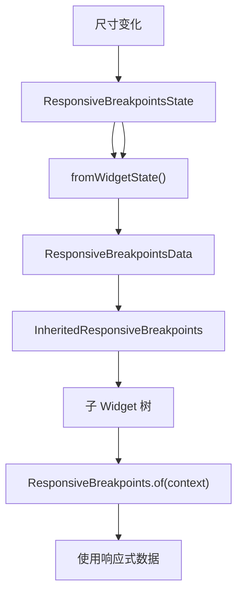

# ResponsiveBreakpointsData 代码讲解

## 概述

`ResponsiveBreakpointsData` 是响应式框架中的核心数据类，用于封装当前屏幕的响应式信息。它是一个不可变的数据类，包含了屏幕尺寸、当前匹配的断点、设备类型标识等关键信息，供子 Widget 使用以构建响应式布局。

### 核心职责

1. **数据封装**：封装屏幕尺寸、断点信息、设备类型等响应式数据
2. **数据提供**：通过 `InheritedWidget` 模式向子 Widget 提供响应式信息
3. **断点比较**：提供便捷的方法用于判断屏幕尺寸与断点的关系
4. **设备识别**：提供布尔属性快速判断设备类型（手机、平板、桌面等）

### 在响应式框架中的位置

`ResponsiveBreakpointsData` 位于数据流的核心位置：



**数据流向**：

1. `ResponsiveBreakpointsState` 监听屏幕尺寸变化
2. 通过 `fromWidgetState()` 创建 `ResponsiveBreakpointsData` 实例
3. 包装在 `InheritedResponsiveBreakpoints` 中
4. 子 Widget 通过 `ResponsiveBreakpoints.of(context)` 获取数据

### 与相关类的关系

- **ResponsiveBreakpointsState**：状态管理类，提供原始数据（屏幕尺寸、断点等）
- **ResponsiveBreakpointsData**：数据封装类，将 State 的数据转换为不可变的数据对象
- **InheritedResponsiveBreakpoints**：数据传递类，通过 `InheritedWidget` 向子 Widget 提供数据
- **Breakpoint**：断点定义类，包含断点的范围（start、end）和名称

## 类定义和特性

### 类声明

```dart
@immutable
class ResponsiveBreakpointsData {
  // ...
}
```

### 不可变性设计

`ResponsiveBreakpointsData` 使用 `@immutable` 注解标记为不可变类，这意味着：

1. **所有字段都是 final**：创建后无法修改
2. **线程安全**：多个 Widget 可以安全地共享同一个实例
3. **性能优化**：可以作为 `const` 常量，减少对象创建
4. **值比较**：通过 `==` 和 `hashCode` 进行值比较，而非引用比较

**设计优势**：

- 避免意外的数据修改
- 简化状态管理
- 提高性能（可以复用实例）
- 便于调试（数据不会意外变化）

## 属性详解

### 屏幕尺寸属性

#### screenWidth

```dart
final double screenWidth;
```

**作用**：当前屏幕的计算宽度（用于断点匹配）。

**说明**：

- 这是经过计算的宽度，可能受 `useShortestSide` 选项影响
- 当 `useShortestSide = true` 时，使用 `min(windowWidth, windowHeight)`
- 当 `useShortestSide = false` 时，使用实际的窗口宽度
- 用于断点匹配和尺寸比较

**示例**：

```dart
final responsive = ResponsiveBreakpoints.of(context);
print('屏幕宽度: ${responsive.screenWidth}');
```

#### screenHeight

```dart
final double screenHeight;
```

**作用**：当前屏幕的计算高度。

**说明**：

- 这是经过计算的高度，可能受 `useShortestSide` 选项影响
- 当 `useShortestSide = true` 时，使用 `max(windowWidth, windowHeight)`
- 当 `useShortestSide = false` 时，使用实际的窗口高度

### 断点相关属性

#### breakpoint

```dart
final Breakpoint breakpoint;
```

**作用**：当前匹配的断点。

**说明**：

- 根据 `screenWidth` 从 `breakpoints` 列表中匹配得到
- 匹配规则：`screenWidth >= breakpoint.start && screenWidth <= breakpoint.end`
- 如果未匹配到任何断点，使用默认值 `Breakpoint(start: 0, end: 0)`
- 包含断点的名称、范围、附加数据等信息

**使用示例**：

```dart
final responsive = ResponsiveBreakpoints.of(context);
print('当前断点: ${responsive.breakpoint.name}');
print('断点范围: ${responsive.breakpoint.start} - ${responsive.breakpoint.end}');
```

#### breakpoints

```dart
final List<Breakpoint> breakpoints;
```

**作用**：当前激活的断点列表。

**说明**：

- 根据屏幕方向和平台筛选后的断点列表
- 已按 `start` 值排序
- 用于断点比较方法（`largerThan`、`smallerThan` 等）
- 包含所有可用的断点定义

**使用示例**：

```dart
final responsive = ResponsiveBreakpoints.of(context);
for (var bp in responsive.breakpoints) {
  print('${bp.name}: ${bp.start} - ${bp.end}');
}
```

### 设备类型标识

#### isMobile

```dart
final bool isMobile;
```

**作用**：判断当前断点是否为移动设备（`MOBILE`）。

**说明**：

- 当 `breakpoint.name == MOBILE` 时为 `true`
- 用于快速判断是否为移动设备
- 通常用于条件布局

**使用示例**：

```dart
final responsive = ResponsiveBreakpoints.of(context);
if (responsive.isMobile) {
  return MobileLayout();
}
```

#### isPhone

```dart
final bool isPhone;
```

**作用**：判断当前断点是否为手机（`PHONE`）。

**说明**：

- 当 `breakpoint.name == PHONE` 时为 `true`
- 用于区分手机和平板设备
- 手机通常比平板更小

#### isTablet

```dart
final bool isTablet;
```

**作用**：判断当前断点是否为平板（`TABLET`）。

**说明**：

- 当 `breakpoint.name == TABLET` 时为 `true`
- 用于区分平板和手机/桌面设备
- 平板通常介于手机和桌面之间

#### isDesktop

```dart
final bool isDesktop;
```

**作用**：判断当前断点是否为桌面设备（`DESKTOP`）。

**说明**：

- 当 `breakpoint.name == DESKTOP` 时为 `true`
- 用于判断是否为桌面设备
- 桌面设备通常有更大的屏幕空间

**设备类型判断示例**：

```dart
final responsive = ResponsiveBreakpoints.of(context);

if (responsive.isPhone) {
  return PhoneLayout();
} else if (responsive.isTablet) {
  return TabletLayout();
} else if (responsive.isDesktop) {
  return DesktopLayout();
} else {
  return DefaultLayout();
}
```

### 屏幕方向

#### orientation

```dart
final Orientation orientation;
```

**作用**：当前屏幕方向。

**说明**：

- 类型为 `Orientation`（`portrait` 或 `landscape`）
- 根据窗口宽高比计算：`windowWidth > windowHeight ? landscape : portrait`
- 用于横竖屏不同的布局策略

**使用示例**：

```dart
final responsive = ResponsiveBreakpoints.of(context);
if (responsive.orientation == Orientation.landscape) {
  return LandscapeLayout();
} else {
  return PortraitLayout();
}
```

## 构造函数

### 默认构造函数

```dart
const ResponsiveBreakpointsData({
  this.screenWidth = 0,
  this.screenHeight = 0,
  this.breakpoint = const Breakpoint(start: 0, end: 0),
  this.breakpoints = const [],
  this.isMobile = false,
  this.isPhone = false,
  this.isTablet = false,
  this.isDesktop = false,
  this.orientation = Orientation.portrait,
});
```

**作用**：创建响应式数据实例，使用显式值。

**使用场景**：

- 测试场景：创建测试数据
- 默认值：提供初始状态
- 自定义创建：需要手动指定所有值时

**注意事项**：

- 所有参数都有默认值
- 可以使用 `const` 关键字创建常量实例
- 通常不直接使用，而是通过 `fromWidgetState()` 创建

**示例**：

```dart
// 创建测试数据
const testData = ResponsiveBreakpointsData(
  screenWidth: 800,
  screenHeight: 600,
  breakpoint: Breakpoint(start: 601, end: 1200, name: TABLET),
  isTablet: true,
);
```

### fromWidgetState() 工厂方法

```dart
static ResponsiveBreakpointsData fromWidgetState(
    ResponsiveBreakpointsState state) {
  return ResponsiveBreakpointsData(
    screenWidth: state.screenWidth,
    screenHeight: state.screenHeight,
    breakpoint: state.breakpoint,
    breakpoints: state.breakpoints,
    isMobile: state.breakpoint.name == MOBILE,
    isPhone: state.breakpoint.name == PHONE,
    isTablet: state.breakpoint.name == TABLET,
    isDesktop: state.breakpoint.name == DESKTOP,
    orientation: state.orientation,
  );
}
```

**作用**：基于 `ResponsiveBreakpointsState` 创建 `ResponsiveBreakpointsData` 实例。

**实现逻辑**：

1. **直接映射**：将 State 的尺寸、断点信息直接映射到 Data
2. **设备类型计算**：根据 `breakpoint.name` 计算设备类型标识
3. **方向传递**：直接使用 State 的方向信息

**使用场景**：

- `ResponsiveBreakpointsState.build()` 中调用
- 每次状态更新时创建新的数据实例
- 将可变状态转换为不可变数据

**设计优势**：

- 封装状态转换逻辑
- 确保数据一致性
- 简化创建过程

## 方法详解

### equals() 方法

```dart
bool equals(String name) => breakpoint.name == name;
```

**作用**：判断当前断点名称是否等于指定名称。

**参数**：

- `name`：要比较的断点名称（如 `MOBILE`、`TABLET` 等）

**返回值**：如果当前断点名称等于 `name`，返回 `true`，否则返回 `false`。

**使用示例**：

```dart
final responsive = ResponsiveBreakpoints.of(context);
if (responsive.equals(MOBILE)) {
  // 当前是移动设备断点
}
```

**等价写法**：

```dart
// 以下两种写法等价
responsive.equals(MOBILE)
responsive.breakpoint.name == MOBILE
```

### largerThan() 方法

```dart
bool largerThan(String name) =>
    screenWidth >
    (breakpoints.firstWhereOrNull((element) => element.name == name)?.end ??
        double.infinity);
```

**作用**：判断当前屏幕宽度是否大于指定断点的结束值。

**参数**：

- `name`：断点名称

**返回值**：

- 如果找到断点且 `screenWidth > breakpoint.end`，返回 `true`
- 如果未找到断点，返回 `false`（使用 `double.infinity` 确保返回 `false`）

**逻辑说明**：

1. 在 `breakpoints` 列表中查找名称为 `name` 的断点
2. 如果找到，比较 `screenWidth` 与 `breakpoint.end`
3. 如果未找到，返回 `false`

**使用示例**：

```dart
final responsive = ResponsiveBreakpoints.of(context);
if (responsive.largerThan(TABLET)) {
  // 屏幕宽度大于平板断点的结束值
  return DesktopLayout();
}
```

**典型场景**：判断是否超过某个断点范围，进入更大的断点。

### largerOrEqualTo() 方法

```dart
bool largerOrEqualTo(String name) =>
    screenWidth >=
    (breakpoints.firstWhereOrNull((element) => element.name == name)?.start ??
        double.infinity);
```

**作用**：判断当前屏幕宽度是否大于或等于指定断点的起始值。

**参数**：

- `name`：断点名称

**返回值**：

- 如果找到断点且 `screenWidth >= breakpoint.start`，返回 `true`
- 如果未找到断点，返回 `false`

**逻辑说明**：

1. 在 `breakpoints` 列表中查找名称为 `name` 的断点
2. 如果找到，比较 `screenWidth` 与 `breakpoint.start`
3. 如果未找到，返回 `false`

**使用示例**：

```dart
final responsive = ResponsiveBreakpoints.of(context);
if (responsive.largerOrEqualTo(DESKTOP)) {
  // 屏幕宽度达到或超过桌面断点的起始值
  return DesktopLayout();
}
```

**典型场景**：判断是否达到某个断点的最小宽度要求。

### smallerThan() 方法

```dart
bool smallerThan(String name) =>
    screenWidth <
    (breakpoints.firstWhereOrNull((element) => element.name == name)?.start ??
        0);
```

**作用**：判断当前屏幕宽度是否小于指定断点的起始值。

**参数**：

- `name`：断点名称

**返回值**：

- 如果找到断点且 `screenWidth < breakpoint.start`，返回 `true`
- 如果未找到断点，返回 `false`（使用 `0` 确保返回 `false`）

**逻辑说明**：

1. 在 `breakpoints` 列表中查找名称为 `name` 的断点
2. 如果找到，比较 `screenWidth` 与 `breakpoint.start`
3. 如果未找到，返回 `false`

**使用示例**：

```dart
final responsive = ResponsiveBreakpoints.of(context);
if (responsive.smallerThan(TABLET)) {
  // 屏幕宽度小于平板断点的起始值
  return MobileLayout();
}
```

**典型场景**：判断是否小于某个断点，使用更小的布局。

### smallerOrEqualTo() 方法

```dart
bool smallerOrEqualTo(String name) =>
    screenWidth <=
    (breakpoints.firstWhereOrNull((element) => element.name == name)?.end ??
        0);
```

**作用**：判断当前屏幕宽度是否小于或等于指定断点的结束值。

**参数**：

- `name`：断点名称

**返回值**：

- 如果找到断点且 `screenWidth <= breakpoint.end`，返回 `true`
- 如果未找到断点，返回 `false`

**逻辑说明**：

1. 在 `breakpoints` 列表中查找名称为 `name` 的断点
2. 如果找到，比较 `screenWidth` 与 `breakpoint.end`
3. 如果未找到，返回 `false`

**使用示例**：

```dart
final responsive = ResponsiveBreakpoints.of(context);
if (responsive.smallerOrEqualTo(MOBILE)) {
  // 屏幕宽度在移动设备断点范围内
  return MobileLayout();
}
```

**典型场景**：判断是否在某个断点范围内。

### between() 方法

```dart
bool between(String name, String name1) {
  return (screenWidth >=
          (breakpoints
                  .firstWhereOrNull((element) => element.name == name)
                  ?.start ??
              0) &&
      screenWidth <=
          (breakpoints
                  .firstWhereOrNull((element) => element.name == name1)
                  ?.end ??
              0));
}
```

**作用**：判断当前屏幕宽度是否在两个断点之间（包含边界）。

**参数**：

- `name`：第一个断点名称（下界）
- `name1`：第二个断点名称（上界）

**返回值**：

- 如果 `screenWidth` 在 `[name.start, name1.end]` 范围内，返回 `true`
- 如果任一断点未找到，返回 `false`

**逻辑说明**：

1. 查找两个断点
2. 检查 `screenWidth` 是否在 `[name.start, name1.end]` 范围内
3. 如果任一断点未找到，使用默认值 `0`，通常会导致返回 `false`

**使用示例**：

```dart
final responsive = ResponsiveBreakpoints.of(context);
if (responsive.between(MOBILE, TABLET)) {
  // 屏幕宽度在移动设备和平板设备之间
  return MediumLayout();
}
```

**注意事项**：

- 两个断点必须都存在，否则可能返回错误结果
- 范围是 `[name.start, name1.end]`，可能跨越多个断点
- 如果两个断点有重叠，结果可能不符合预期

**典型场景**：判断屏幕宽度是否在某个范围内，使用特定的布局策略。

### toString() 方法

```dart
@override
String toString() =>
    'ResponsiveBreakpoints(breakpoint: $breakpoint, breakpoints: ${breakpoints.asMap()}, isMobile: $isMobile, isPhone: $isPhone, isTablet: $isTablet, isDesktop: $isDesktop)';
```

**作用**：返回对象的字符串表示，用于调试和日志。

**返回值**：包含关键信息的字符串。

**输出示例**：

```
ResponsiveBreakpoints(breakpoint: Breakpoint(start: 451, end: 800, name: TABLET), breakpoints: {0: Breakpoint(...), 1: Breakpoint(...)}, isMobile: false, isPhone: false, isTablet: true, isDesktop: false)
```

**使用场景**：

- 调试时打印对象信息
- 日志记录
- 开发工具显示

### == 操作符

```dart
@override
bool operator ==(Object other) =>
    identical(this, other) ||
    other is ResponsiveBreakpointsData &&
        runtimeType == other.runtimeType &&
        screenWidth == other.screenWidth &&
        screenHeight == other.screenHeight &&
        breakpoint == other.breakpoint;
```

**作用**：判断两个 `ResponsiveBreakpointsData` 实例是否相等。

**比较逻辑**：

1. **引用相等**：如果是同一个对象（`identical`），返回 `true`
2. **类型检查**：确保是 `ResponsiveBreakpointsData` 类型且运行时类型相同
3. **值比较**：比较 `screenWidth`、`screenHeight` 和 `breakpoint`

**注意事项**：

- 只比较了部分字段（`screenWidth`、`screenHeight`、`breakpoint`）
- 未比较 `breakpoints`、`isMobile` 等字段
- 这是因为这些字段可以从 `breakpoint` 推导出来

**使用示例**：

```dart
final data1 = ResponsiveBreakpointsData(...);
final data2 = ResponsiveBreakpointsData(...);
if (data1 == data2) {
  // 两个实例相等
}
```

### hashCode 属性

```dart
@override
int get hashCode =>
    screenWidth.hashCode * screenHeight.hashCode * breakpoint.hashCode;
```

**作用**：返回对象的哈希码，用于哈希表等数据结构。

**实现逻辑**：

- 使用 `screenWidth`、`screenHeight` 和 `breakpoint` 的哈希码相乘
- 确保相等的对象有相同的哈希码（与 `==` 操作符一致）

**注意事项**：

- 哈希码计算与 `==` 操作符保持一致
- 只使用了 `==` 中比较的字段
- 乘法运算可能导致整数溢出，但在 Dart 中这是安全的

**使用场景**：

- 在 `Set` 或 `Map` 中使用 `ResponsiveBreakpointsData` 作为键
- 性能优化（缓存等）

## 使用示例

### 基本使用

```dart
class MyResponsiveWidget extends StatelessWidget {
  @override
  Widget build(BuildContext context) {
    final responsive = ResponsiveBreakpoints.of(context);
    
    return Scaffold(
      body: Center(
        child: Column(
          mainAxisAlignment: MainAxisAlignment.center,
          children: [
            Text('屏幕宽度: ${responsive.screenWidth}'),
            Text('屏幕高度: ${responsive.screenHeight}'),
            Text('当前断点: ${responsive.breakpoint.name}'),
            Text('方向: ${responsive.orientation}'),
          ],
        ),
      ),
    );
  }
}
```

### 条件布局

```dart
class AdaptiveLayout extends StatelessWidget {
  @override
  Widget build(BuildContext context) {
    final responsive = ResponsiveBreakpoints.of(context);
    
    if (responsive.isMobile) {
      return MobileLayout();
    } else if (responsive.isTablet) {
      return TabletLayout();
    } else {
      return DesktopLayout();
    }
  }
}
```

### 断点比较

```dart
class SmartLayout extends StatelessWidget {
  @override
  Widget build(BuildContext context) {
    final responsive = ResponsiveBreakpoints.of(context);
    
    // 使用 largerThan 判断
    if (responsive.largerThan(TABLET)) {
      return WideLayout();
    }
    
    // 使用 smallerThan 判断
    if (responsive.smallerThan(TABLET)) {
      return CompactLayout();
    }
    
    // 使用 between 判断
    if (responsive.between(MOBILE, TABLET)) {
      return MediumLayout();
    }
    
    return DefaultLayout();
  }
}
```

### 响应式网格布局

```dart
class ResponsiveGrid extends StatelessWidget {
  @override
  Widget build(BuildContext context) {
    final responsive = ResponsiveBreakpoints.of(context);
    
    int crossAxisCount;
    if (responsive.isMobile) {
      crossAxisCount = 2;
    } else if (responsive.isTablet) {
      crossAxisCount = 3;
    } else {
      crossAxisCount = 4;
    }
    
    return GridView.builder(
      gridDelegate: SliverGridDelegateWithFixedCrossAxisCount(
        crossAxisCount: crossAxisCount,
      ),
      itemBuilder: (context, index) => GridItem(index: index),
    );
  }
}
```

### 方向相关布局

```dart
class OrientationAwareLayout extends StatelessWidget {
  @override
  Widget build(BuildContext context) {
    final responsive = ResponsiveBreakpoints.of(context);
    
    if (responsive.orientation == Orientation.landscape) {
      return Row(
        children: [
          Expanded(child: Sidebar()),
          Expanded(flex: 2, child: MainContent()),
        ],
      );
    } else {
      return Column(
        children: [
          Expanded(child: MainContent()),
          Sidebar(),
        ],
      );
    }
  }
}
```

### 复杂条件判断

```dart
class ComplexLayout extends StatelessWidget {
  @override
  Widget build(BuildContext context) {
    final responsive = ResponsiveBreakpoints.of(context);
    
    // 组合多个条件
    if (responsive.isDesktop && 
        responsive.orientation == Orientation.landscape) {
      return WideDesktopLayout();
    }
    
    if (responsive.largerOrEqualTo(TABLET) && 
        responsive.smallerOrEqualTo(DESKTOP)) {
      return TabletToDesktopLayout();
    }
    
    return DefaultLayout();
  }
}
```

## 设计模式和最佳实践

### 不可变数据类模式

`ResponsiveBreakpointsData` 采用不可变数据类设计，具有以下优势：

1. **线程安全**：多个 Widget 可以安全地共享同一个实例
2. **性能优化**：可以作为 `const` 常量，减少对象创建
3. **简化状态管理**：数据不会意外修改，状态更可预测
4. **便于调试**：数据在创建后不会变化，更容易追踪问题

### 值对象模式

`ResponsiveBreakpointsData` 实现了值对象（Value Object）模式：

- 通过 `==` 和 `hashCode` 进行值比较
- 相等的对象可以互换使用
- 适合作为缓存键或集合元素

### 工厂方法模式

`fromWidgetState()` 是工厂方法的典型应用：

- 封装对象创建逻辑
- 将 State 转换为 Data
- 确保数据一致性

### 性能考虑

1. **对象创建**：每次状态更新都会创建新实例，但由于是不可变对象，可以安全共享
2. **比较效率**：`==` 操作符只比较关键字段，提高比较效率
3. **哈希计算**：简单的乘法运算，性能良好
4. **查找优化**：断点比较方法使用 `firstWhereOrNull`，在断点数量较少时性能可接受

### 最佳实践建议

1. **使用设备类型标识**：优先使用 `isMobile`、`isTablet` 等布尔属性，而非字符串比较
2. **合理使用比较方法**：根据需求选择合适的比较方法（`largerThan`、`smallerThan`、`between` 等）
3. **避免频繁创建**：通过 `ResponsiveBreakpoints.of(context)` 获取数据，框架会自动管理更新
4. **组合条件判断**：可以组合多个条件实现复杂的布局逻辑
5. **考虑性能**：在性能敏感的场景，可以缓存计算结果

## 总结

`ResponsiveBreakpointsData` 是响应式框架的核心数据类，提供了：

1. **完整的数据封装**：屏幕尺寸、断点信息、设备类型、方向等
2. **便捷的比较方法**：`largerThan`、`smallerThan`、`between` 等
3. **设备类型标识**：`isMobile`、`isTablet`、`isDesktop` 等布尔属性
4. **不可变设计**：线程安全、性能优化、易于调试
5. **值对象特性**：支持值比较和哈希操作

理解 `ResponsiveBreakpointsData` 的设计和使用方法，有助于更好地构建响应式 Flutter 应用。
