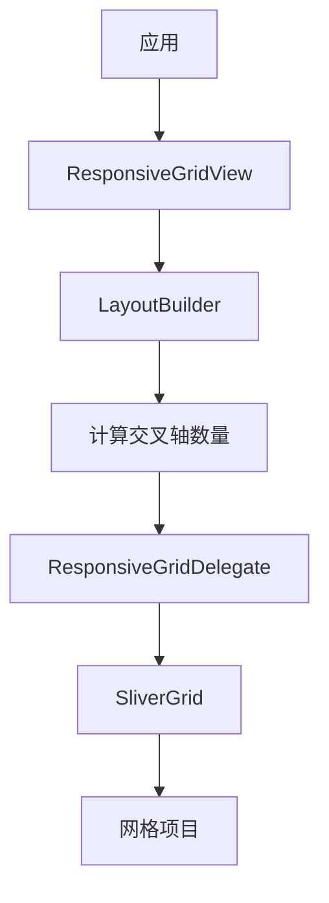

# ResponsiveGrid 代码讲解

## 概述

`ResponsiveGridView` 是响应式框架中扩展了 Flutter `GridView` 功能的响应式网格视图 Widget。它通过自定义的 `ResponsiveGridDelegate` 提供了更灵活的网格布局控制，包括固定尺寸、最大尺寸、最小尺寸三种模式，以及对齐控制和行数限制等功能。

### 核心职责

1. **响应式网格布局**：根据屏幕尺寸自动调整网格列数和项目尺寸
2. **灵活的尺寸控制**：支持固定、最大、最小三种尺寸模式
3. **对齐控制**：支持左对齐、居中、右对齐
4. **行数限制**：可以限制显示的行数

### 在响应式框架中的位置

`ResponsiveGridView` 位于响应式布局组件层：



**数据流向**：

1. `ResponsiveGridView` 使用 `LayoutBuilder` 获取可用空间
2. 根据 `ResponsiveGridDelegate` 的配置计算交叉轴数量
3. 处理对齐和行数限制
4. 使用 `SliverGrid` 渲染网格

### 与相关类的关系

- **GridView**：Flutter 原生 Widget，提供基础网格功能
- **ResponsiveGridDelegate**：自定义的 `SliverGridDelegate`，提供尺寸控制
- **SliverGrid**：Flutter 的 Sliver Widget，实际渲染网格
- **LayoutBuilder**：Flutter 原生 Widget，提供布局约束

## ResponsiveGridView 类详解

### 类定义

```dart
class ResponsiveGridView extends StatelessWidget
```

`ResponsiveGridView` 继承自 `StatelessWidget`，是一个无状态的 Widget。

### 属性详解

#### 滚动相关属性

```dart
final Axis scrollDirection;
final bool reverse;
final ScrollController? controller;
final bool? primary;
final ScrollPhysics? physics;
final bool shrinkWrap;
```

这些属性与 Flutter 的 `ScrollView` 相同，控制滚动行为。

#### alignment

```dart
final AlignmentGeometry alignment;
```

**作用**：网格项目的对齐方式。

**说明**：

- 默认值为 `Alignment.centerLeft`
- 支持左对齐、居中、右对齐
- 通过计算额外的 padding 实现对齐

#### gridDelegate

```dart
final ResponsiveGridDelegate gridDelegate;
```

**作用**：网格布局代理，定义项目尺寸和间距。

**说明**：

- 必需参数
- 控制项目的交叉轴尺寸（宽度）
- 定义项目间距和宽高比

#### 子项相关属性

```dart
final IndexedWidgetBuilder? itemBuilder;
final List<Widget>? children;
final int? itemCount;
```

- `itemBuilder`：用于 `builder` 构造函数，动态构建项目
- `children`：用于默认构造函数，直接提供 Widget 列表
- `itemCount`：项目总数（用于 `builder` 构造函数）

#### maxRowCount

```dart
final int? maxRowCount;
```

**作用**：限制最大行数。

**说明**：

- 类型为 `int?`，可以为 `null`
- 如果设置，限制显示的行数
- 通过限制 `itemCount` 实现

### 构造函数

#### 默认构造函数

```dart
const ResponsiveGridView({
  super.key,
  this.scrollDirection = Axis.vertical,
  this.reverse = false,
  this.controller,
  this.primary,
  this.physics,
  this.shrinkWrap = false,
  this.padding,
  this.alignment = Alignment.centerLeft,
  required this.gridDelegate,
  this.children = const <Widget>[],
  this.maxRowCount,
  // ... 其他属性
}) : itemBuilder = null,
      itemCount = children?.length,
      assert(children != null);
```

用于直接提供 `children` 列表的场景。

#### builder 构造函数

```dart
const ResponsiveGridView.builder({
  super.key,
  // ... 属性
  required this.itemBuilder,
  this.itemCount,
  // ...
}) : children = null;
```

用于动态构建大量项目的场景。

### build() 方法详解

`build()` 方法的核心逻辑：

1. **使用 LayoutBuilder 获取约束**
2. **计算交叉轴数量**：根据 `gridDelegate` 的配置
3. **计算对齐 padding**：根据 `alignment` 设置
4. **处理行数限制**：如果设置了 `maxRowCount`
5. **构建子项代理**：根据使用的构造函数
6. **返回布局 Widget**

#### 交叉轴数量计算

根据 `ResponsiveGridDelegate` 的三种模式计算：

**固定尺寸模式**（`crossAxisExtent != null`）：

```dart
crossAxisCount = (crossAxisExtent /
        (gridDelegate.crossAxisExtent! + gridDelegate.crossAxisSpacing))
    .floor();
```

- 使用 `floor()` 向下取整
- 计算能容纳多少个固定尺寸的项目

**最大尺寸模式**（`maxCrossAxisExtent != null`）：

```dart
crossAxisCount = (crossAxisExtent /
        (gridDelegate.maxCrossAxisExtent! + gridDelegate.crossAxisSpacing))
    .ceil();
```

- 使用 `ceil()` 向上取整
- 确保项目不超过最大尺寸

**最小尺寸模式**（`minCrossAxisExtent != null`）：

```dart
crossAxisCount = (crossAxisExtent /
        (gridDelegate.minCrossAxisExtent! + gridDelegate.crossAxisSpacing))
    .floor();
```

- 使用 `floor()` 向下取整
- 确保项目不小于最小尺寸

#### 对齐处理

对齐通过计算额外的 padding 实现：

**左对齐**：

```dart
if (alignment == Alignment.centerLeft || ...) {
  alignmentPadding = const EdgeInsets.only(left: 0);
}
```

**居中对齐**：

```dart
else if (alignment == Alignment.center || ...) {
  double paddingCalc = constraints.maxWidth - crossAxisWidth;
  if (paddingCalc > gridDelegate.crossAxisSpacing) {
    alignmentPadding = EdgeInsets.only(
      left: ((constraints.maxWidth - crossAxisWidth - 
              gridDelegate.crossAxisSpacing) / 2) +
          gridDelegate.crossAxisSpacing
    );
  }
}
```

**右对齐**：

```dart
else {
  alignmentPadding = EdgeInsets.only(
    left: constraints.maxWidth - crossAxisWidth
  );
}
```

## ResponsiveGridDelegate 类详解

### 类定义

```dart
class ResponsiveGridDelegate extends SliverGridDelegate
```

`ResponsiveGridDelegate` 继承自 `SliverGridDelegate`，是自定义的网格布局代理。

### 属性详解

#### 尺寸控制属性

```dart
final double? crossAxisExtent;      // 固定尺寸
final double? maxCrossAxisExtent;    // 最大尺寸
final double? minCrossAxisExtent;    // 最小尺寸
```

**说明**：

- 三个属性互斥，只能设置一个
- `crossAxisExtent`：固定项目宽度
- `maxCrossAxisExtent`：最大项目宽度（项目可以更小）
- `minCrossAxisExtent`：最小项目宽度（项目可以更大）

#### 间距属性

```dart
final double mainAxisSpacing;    // 主轴间距（行间距）
final double crossAxisSpacing;   // 交叉轴间距（列间距）
```

#### childAspectRatio

```dart
final double childAspectRatio;
```

**作用**：子项的宽高比。

**说明**：

- 默认值为 `1.0`（正方形）
- 计算公式：`height = width / childAspectRatio`
- 大于 1.0 表示宽大于高，小于 1.0 表示高大于宽

### 构造函数

```dart
const ResponsiveGridDelegate({
  this.crossAxisExtent,
  this.maxCrossAxisExtent,
  this.minCrossAxisExtent,
  this.mainAxisSpacing = 0,
  this.crossAxisSpacing = 0,
  this.childAspectRatio = 1,
}) : assert(
      (crossAxisExtent != null && crossAxisExtent >= 0) ||
      (maxCrossAxisExtent != null && maxCrossAxisExtent >= 0) ||
      (minCrossAxisExtent != null && minCrossAxisExtent >= 0),
      'Must provide a valid cross axis extent.'),
    assert(mainAxisSpacing >= 0),
    assert(crossAxisSpacing >= 0),
    assert(childAspectRatio > 0);
```

**断言验证**：

1. 必须提供且仅提供一个尺寸属性
2. 间距必须 >= 0
3. 宽高比必须 > 0

### getLayout() 方法详解

`getLayout()` 方法根据尺寸模式计算布局：

#### 固定尺寸模式

```dart
if (crossAxisExtent != null) {
  crossAxisCount = (constraints.crossAxisExtent / 
      (crossAxisExtent! + crossAxisSpacing)).floor();
  childCrossAxisExtent = crossAxisExtent;
  childMainAxisExtent = childCrossAxisExtent! / childAspectRatio;
  mainAxisStride = childMainAxisExtent + mainAxisSpacing;
  crossAxisStride = childCrossAxisExtent + crossAxisSpacing;
}
```

- 交叉轴数量：向下取整
- 项目宽度：固定为 `crossAxisExtent`
- 项目高度：根据宽高比计算

#### 最大尺寸模式

```dart
else if (maxCrossAxisExtent != null) {
  crossAxisCount = (constraints.crossAxisExtent / 
      (maxCrossAxisExtent! + crossAxisSpacing)).ceil();
  final double usableCrossAxisExtent = 
      constraints.crossAxisExtent - crossAxisSpacing * (crossAxisCount - 1);
  childCrossAxisExtent = usableCrossAxisExtent / crossAxisCount;
  childMainAxisExtent = childCrossAxisExtent / childAspectRatio;
  // ...
}
```

- 交叉轴数量：向上取整
- 可用宽度：总宽度减去间距
- 项目宽度：平均分配可用宽度

#### 最小尺寸模式

```dart
else {
  crossAxisCount = (constraints.crossAxisExtent / 
      (minCrossAxisExtent! + crossAxisSpacing)).floor();
  final double usableCrossAxisExtent = 
      constraints.crossAxisExtent - crossAxisSpacing * (crossAxisCount - 1);
  childCrossAxisExtent = usableCrossAxisExtent / crossAxisCount;
  // ...
}
```

- 交叉轴数量：向下取整
- 项目宽度：平均分配，确保 >= `minCrossAxisExtent`

## 使用示例

### 固定尺寸网格

```dart
ResponsiveGridView(
  gridDelegate: ResponsiveGridDelegate(
    crossAxisExtent: 200,
    crossAxisSpacing: 16,
    mainAxisSpacing: 16,
    childAspectRatio: 1.0,
  ),
  children: [
    GridItem1(),
    GridItem2(),
    GridItem3(),
  ],
)
```

### 最大尺寸网格

```dart
ResponsiveGridView(
  gridDelegate: ResponsiveGridDelegate(
    maxCrossAxisExtent: 300,
    crossAxisSpacing: 16,
    mainAxisSpacing: 16,
  ),
  children: [
    GridItem1(),
    GridItem2(),
    GridItem3(),
  ],
)
```

### 最小尺寸网格

```dart
ResponsiveGridView(
  gridDelegate: ResponsiveGridDelegate(
    minCrossAxisExtent: 150,
    crossAxisSpacing: 16,
    mainAxisSpacing: 16,
  ),
  children: [
    GridItem1(),
    GridItem2(),
    GridItem3(),
  ],
)
```

### 居中对齐

```dart
ResponsiveGridView(
  alignment: Alignment.center,
  gridDelegate: ResponsiveGridDelegate(
    maxCrossAxisExtent: 200,
    crossAxisSpacing: 16,
  ),
  children: [...],
)
```

### 限制行数

```dart
ResponsiveGridView(
  maxRowCount: 2,
  gridDelegate: ResponsiveGridDelegate(
    maxCrossAxisExtent: 200,
  ),
  children: [...],
)
```

### 使用 builder 构造函数

```dart
ResponsiveGridView.builder(
  gridDelegate: ResponsiveGridDelegate(
    maxCrossAxisExtent: 200,
    crossAxisSpacing: 16,
    mainAxisSpacing: 16,
  ),
  itemBuilder: (context, index) {
    return GridItem(index: index);
  },
  itemCount: 100,
)
```

### 响应式网格

```dart
ResponsiveGridView(
  gridDelegate: ResponsiveGridDelegate(
    maxCrossAxisExtent: ResponsiveValue<double>(
      context,
      defaultValue: 200,
      conditionalValues: [
        Condition.equals(name: DESKTOP, value: 300),
        Condition.equals(name: TABLET, value: 250),
        Condition.equals(name: MOBILE, value: 150),
      ],
    ).value,
    crossAxisSpacing: 16,
    mainAxisSpacing: 16,
  ),
  children: [...],
)
```

## 设计模式和最佳实践

### 委托模式

`ResponsiveGridDelegate` 采用了委托模式：

- **职责分离**：布局计算逻辑封装在 Delegate 中
- **可扩展性**：可以创建自定义的 Delegate
- **复用性**：同一个 Delegate 可以用于多个 GridView

### 最佳实践建议

1. **选择合适的尺寸模式**：
   - 固定尺寸：需要精确控制项目大小
   - 最大尺寸：希望项目尽可能大但不超限
   - 最小尺寸：希望项目尽可能小但不低于最小值

2. **合理设置间距**：考虑视觉美观和可用空间

3. **使用宽高比**：根据内容类型设置合适的宽高比

4. **响应式设计**：结合 `ResponsiveValue` 为不同设备设置不同的尺寸

5. **性能考虑**：
   - 大量项目时使用 `builder` 构造函数
   - 合理设置 `cacheExtent`

## 总结

`ResponsiveGridView` 和 `ResponsiveGridDelegate` 提供了强大的响应式网格布局功能：

1. **灵活的尺寸控制**：支持固定、最大、最小三种模式
2. **自动布局计算**：根据屏幕尺寸自动调整列数和项目尺寸
3. **对齐控制**：支持左对齐、居中、右对齐
4. **行数限制**：可以限制显示的行数
5. **易于使用**：简单的 API，易于理解和使用

理解这些类的设计和使用方法，有助于更好地构建响应式 Flutter 应用，实现灵活的网格布局。
