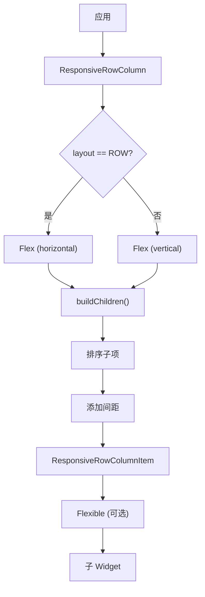

# ResponsiveRowColumn 代码讲解

## 概述

`ResponsiveRowColumn` 是响应式框架中用于在 Row 和 Column 布局之间切换的便捷 Widget。它基于 Flutter 的 `Flex` Widget，提供了统一的 API 来管理水平和垂直布局，支持独立的行/列配置、子项排序、Flex 控制、间距和内边距等功能。

### 核心职责

1. **行列切换**：根据 `layout` 参数在 Row 和 Column 之间切换
2. **独立配置**：为行和列提供独立的对齐、大小、方向等配置
3. **子项排序**：通过 `rowOrder` 和 `columnOrder` 控制子项顺序
4. **Flex 控制**：支持为每个子项设置独立的 Flex 和 FlexFit
5. **间距管理**：支持行间距和列间距

### 在响应式框架中的位置

`ResponsiveRowColumn` 位于响应式布局组件层：



**数据流向**：

1. `ResponsiveRowColumn` 根据 `layout` 选择 Row 或 Column
2. 调用 `buildChildren()` 处理子项
3. 按 `rowOrder` 或 `columnOrder` 排序
4. 在子项之间添加间距
5. 每个子项根据配置应用 Flex

### 与相关类的关系

- **Flex**：Flutter 原生 Widget，提供行列布局基础
- **ResponsiveRowColumnItem**：子项包装器，提供排序和 Flex 控制
- **Flexible**：Flutter 原生 Widget，提供 Flex 功能

## ResponsiveRowColumnType 枚举

```dart
enum ResponsiveRowColumnType {
  ROW,
  COLUMN,
}
```

**作用**：定义布局类型。

**说明**：

- `ROW`：水平布局（Row）
- `COLUMN`：垂直布局（Column）

## ResponsiveRowColumn 类详解

### 类定义

```dart
class ResponsiveRowColumn extends StatelessWidget
```

`ResponsiveRowColumn` 继承自 `StatelessWidget`，是一个无状态的 Widget。

### 属性详解

#### children

```dart
final List<ResponsiveRowColumnItem> children;
```

**作用**：子项列表。

**说明**：

- 类型为 `List<ResponsiveRowColumnItem>`
- 所有子项必须是 `ResponsiveRowColumnItem` 类型
- 默认值为空列表

#### layout

```dart
final ResponsiveRowColumnType layout;
```

**作用**：布局类型，决定使用 Row 还是 Column。

**说明**：

- 必需参数
- `ResponsiveRowColumnType.ROW`：水平布局
- `ResponsiveRowColumnType.COLUMN`：垂直布局

#### 行相关属性

```dart
final MainAxisAlignment rowMainAxisAlignment;
final MainAxisSize rowMainAxisSize;
final CrossAxisAlignment rowCrossAxisAlignment;
final TextDirection? rowTextDirection;
final VerticalDirection rowVerticalDirection;
final TextBaseline? rowTextBaseline;
```

这些属性与 Flutter 的 `Row` Widget 相同，控制行的布局行为。

#### 列相关属性

```dart
final MainAxisAlignment columnMainAxisAlignment;
final MainAxisSize columnMainAxisSize;
final CrossAxisAlignment columnCrossAxisAlignment;
final TextDirection? columnTextDirection;
final VerticalDirection columnVerticalDirection;
final TextBaseline? columnTextBaseline;
```

这些属性与 Flutter 的 `Column` Widget 相同，控制列的布局行为。

#### 间距属性

```dart
final double? rowSpacing;
final double? columnSpacing;
```

**作用**：子项之间的间距。

**说明**：

- `rowSpacing`：Row 布局时子项之间的水平间距
- `columnSpacing`：Column 布局时子项之间的垂直间距
- 如果为 `null`，不添加间距

#### 内边距属性

```dart
final EdgeInsets rowPadding;
final EdgeInsets columnPadding;
```

**作用**：容器的内边距。

**说明**：

- `rowPadding`：Row 布局时的内边距
- `columnPadding`：Column 布局时的内边距
- 默认值为 `EdgeInsets.zero`

#### 便捷属性

```dart
get isRow => layout == ResponsiveRowColumnType.ROW;
get isColumn => layout == ResponsiveRowColumnType.COLUMN;
```

**作用**：快速判断当前布局类型。

### 构造函数

```dart
const ResponsiveRowColumn({
  super.key,
  this.children = const [],
  required this.layout,
  this.rowMainAxisAlignment = MainAxisAlignment.start,
  this.rowMainAxisSize = MainAxisSize.max,
  this.rowCrossAxisAlignment = CrossAxisAlignment.center,
  this.rowTextDirection,
  this.rowVerticalDirection = VerticalDirection.down,
  this.rowTextBaseline,
  this.columnMainAxisAlignment = MainAxisAlignment.start,
  this.columnMainAxisSize = MainAxisSize.max,
  this.columnCrossAxisAlignment = CrossAxisAlignment.center,
  this.columnTextDirection,
  this.columnVerticalDirection = VerticalDirection.down,
  this.columnTextBaseline,
  this.rowSpacing,
  this.columnSpacing,
  this.rowPadding = EdgeInsets.zero,
  this.columnPadding = EdgeInsets.zero,
});
```

**参数说明**：

- `layout`：必需的布局类型
- 其他参数都有合理的默认值

### build() 方法详解

```dart
@override
Widget build(BuildContext context) {
  if (layout == ResponsiveRowColumnType.ROW) {
    return Padding(
      padding: rowPadding,
      child: Flex(
        direction: Axis.horizontal,
        mainAxisAlignment: rowMainAxisAlignment,
        mainAxisSize: rowMainAxisSize,
        crossAxisAlignment: rowCrossAxisAlignment,
        textDirection: rowTextDirection,
        verticalDirection: rowVerticalDirection,
        textBaseline: rowTextBaseline,
        children: [
          ...buildChildren(children, true, rowSpacing),
        ],
      ),
    );
  }

  return Padding(
    padding: columnPadding,
    child: Flex(
      direction: Axis.vertical,
      mainAxisAlignment: columnMainAxisAlignment,
      mainAxisSize: columnMainAxisSize,
      crossAxisAlignment: columnCrossAxisAlignment,
      textDirection: columnTextDirection,
      verticalDirection: columnVerticalDirection,
      textBaseline: columnTextBaseline,
      children: [
        ...buildChildren(children, false, columnSpacing),
      ],
    ),
  );
}
```

**实现逻辑**：

1. **判断布局类型**：根据 `layout` 选择 Row 或 Column
2. **应用内边距**：使用对应的 padding
3. **创建 Flex Widget**：设置对应的方向和相关属性
4. **构建子项**：调用 `buildChildren()` 处理子项列表

### buildChildren() 方法详解

```dart
List<Widget> buildChildren(
    List<ResponsiveRowColumnItem> children, bool rowColumn, double? spacing) {
  // Sort ResponsiveRowColumnItems by their order.
  List<ResponsiveRowColumnItem> childrenHolder = [];
  childrenHolder.addAll(children);
  childrenHolder.sort((a, b) {
    if (rowColumn) {
      return a.rowOrder.compareTo(b.rowOrder);
    } else {
      return a.columnOrder.compareTo(b.columnOrder);
    }
  });
  // Add padding between widgets..
  List<Widget> widgetList = [];
  for (int i = 0; i < childrenHolder.length; i++) {
    widgetList.add(childrenHolder[i].copyWith(rowColumn: rowColumn));
    if (spacing != null && i != childrenHolder.length - 1) {
      widgetList.add(Padding(
          padding: rowColumn
              ? EdgeInsets.only(right: spacing)
              : EdgeInsets.only(bottom: spacing)));
    }
  }
  return widgetList;
}
```

**实现逻辑**：

1. **排序子项**：
   - 如果是 Row，按 `rowOrder` 排序
   - 如果是 Column，按 `columnOrder` 排序
   - 使用 `compareTo()` 进行数值比较

2. **构建 Widget 列表**：
   - 遍历排序后的子项
   - 调用 `copyWith(rowColumn: rowColumn)` 更新子项的方向信息
   - 如果不是最后一个子项且设置了间距，添加 `Padding` Widget

3. **间距处理**：
   - Row 布局：在右侧添加间距（`EdgeInsets.only(right: spacing)`）
   - Column 布局：在底部添加间距（`EdgeInsets.only(bottom: spacing)`）

## ResponsiveRowColumnItem 类详解

### 类定义

```dart
class ResponsiveRowColumnItem extends StatelessWidget
```

`ResponsiveRowColumnItem` 继承自 `StatelessWidget`，是 `ResponsiveRowColumn` 的子项包装器。

### 属性详解

#### child

```dart
final Widget child;
```

**作用**：子 Widget。

#### rowOrder 和 columnOrder

```dart
final int rowOrder;
final int columnOrder;
```

**作用**：控制子项在 Row 和 Column 中的显示顺序。

**说明**：

- 默认值为 `1073741823`（一个很大的数）
- 数值越小，排序越靠前
- 没有设置 order 的子项会排在最后

#### rowColumn

```dart
final bool rowColumn;
```

**作用**：指示当前是 Row 还是 Column 布局。

**说明**：

- `true`：Row 布局
- `false`：Column 布局
- 由 `ResponsiveRowColumn` 在 `buildChildren()` 中设置

#### rowFlex 和 columnFlex

```dart
final int? rowFlex;
final int? columnFlex;
```

**作用**：控制子项的 Flex 值。

**说明**：

- 类型为 `int?`，可以为 `null`
- 如果设置，子项会被包装在 `Flexible` 中
- 用于控制子项在可用空间中的分配比例

#### rowFit 和 columnFit

```dart
final FlexFit? rowFit;
final FlexFit? columnFit;
```

**作用**：控制子项的 FlexFit。

**说明**：

- 类型为 `FlexFit?`，可以为 `null`
- `FlexFit.loose`：子项可以小于可用空间
- `FlexFit.tight`：子项必须填满可用空间
- 默认值为 `FlexFit.loose`

### 构造函数

```dart
const ResponsiveRowColumnItem({
  super.key,
  required this.child,
  this.rowOrder = 1073741823,
  this.columnOrder = 1073741823,
  this.rowColumn = true,
  this.rowFlex,
  this.columnFlex,
  this.rowFit,
  this.columnFit,
});
```

### build() 方法详解

```dart
@override
Widget build(BuildContext context) {
  if (rowColumn && (rowFlex != null || rowFit != null)) {
    return Flexible(
        flex: rowFlex ?? 1, fit: rowFit ?? FlexFit.loose, child: child);
  } else if (!rowColumn && (columnFlex != null || columnFit != null)) {
    return Flexible(
        flex: columnFlex ?? 1, fit: columnFit ?? FlexFit.loose, child: child);
  }

  return child;
}
```

**实现逻辑**：

1. **Row 布局且设置了 Flex**：
   - 如果 `rowFlex` 或 `rowFit` 不为 `null`
   - 包装在 `Flexible` 中，使用 `rowFlex` 和 `rowFit`

2. **Column 布局且设置了 Flex**：
   - 如果 `columnFlex` 或 `columnFit` 不为 `null`
   - 包装在 `Flexible` 中，使用 `columnFlex` 和 `columnFit`

3. **否则**：直接返回 `child`

### copyWith() 方法

```dart
ResponsiveRowColumnItem copyWith({
  int? rowOrder,
  int? columnOrder,
  bool? rowColumn,
  int? rowFlex,
  int? columnFlex,
  FlexFit? rowFlexFit,
  FlexFit? columnFlexFit,
  Widget? child,
}) =>
    ResponsiveRowColumnItem(
      rowOrder: rowOrder ?? this.rowOrder,
      columnOrder: columnOrder ?? this.columnOrder,
      rowColumn: rowColumn ?? this.rowColumn,
      rowFlex: rowFlex ?? this.rowFlex,
      columnFlex: columnFlex ?? this.columnFlex,
      rowFit: rowFlexFit ?? rowFit,
      columnFit: columnFlexFit ?? columnFit,
      child: child ?? this.child,
    );
```

**作用**：创建当前项的副本，可以修改部分字段。

**说明**：

- 用于在 `buildChildren()` 中更新 `rowColumn` 值
- 保持其他属性不变

## 使用示例

### 基本行列切换

```dart
ResponsiveRowColumn(
  layout: ResponsiveRowColumnType.ROW, // 或 COLUMN
  children: [
    ResponsiveRowColumnItem(child: Widget1()),
    ResponsiveRowColumnItem(child: Widget2()),
    ResponsiveRowColumnItem(child: Widget3()),
  ],
)
```

### 响应式布局切换

```dart
ResponsiveRowColumn(
  layout: ResponsiveValue<ResponsiveRowColumnType>(
    context,
    defaultValue: ResponsiveRowColumnType.COLUMN,
    conditionalValues: [
      Condition.equals(
        name: DESKTOP,
        value: ResponsiveRowColumnType.ROW,
      ),
      Condition.smallerThan(
        name: TABLET,
        value: ResponsiveRowColumnType.COLUMN,
      ),
    ],
  ).value,
  children: [
    ResponsiveRowColumnItem(child: Widget1()),
    ResponsiveRowColumnItem(child: Widget2()),
  ],
)
```

### 子项排序

```dart
ResponsiveRowColumn(
  layout: ResponsiveRowColumnType.ROW,
  children: [
    ResponsiveRowColumnItem(
      child: Widget3(),
      rowOrder: 3, // 排在最后
    ),
    ResponsiveRowColumnItem(
      child: Widget1(),
      rowOrder: 1, // 排在最前
    ),
    ResponsiveRowColumnItem(
      child: Widget2(),
      rowOrder: 2, // 排在中间
    ),
  ],
)
```

### 使用 Flex

```dart
ResponsiveRowColumn(
  layout: ResponsiveRowColumnType.ROW,
  children: [
    ResponsiveRowColumnItem(
      child: Widget1(),
      rowFlex: 1, // 占 1 份
    ),
    ResponsiveRowColumnItem(
      child: Widget2(),
      rowFlex: 2, // 占 2 份
    ),
    ResponsiveRowColumnItem(
      child: Widget3(),
      rowFlex: 1, // 占 1 份
    ),
  ],
)
```

### 使用 FlexFit

```dart
ResponsiveRowColumn(
  layout: ResponsiveRowColumnType.ROW,
  children: [
    ResponsiveRowColumnItem(
      child: Widget1(),
      rowFlex: 1,
      rowFit: FlexFit.tight, // 必须填满
    ),
    ResponsiveRowColumnItem(
      child: Widget2(),
      rowFlex: 1,
      rowFit: FlexFit.loose, // 可以小于可用空间
    ),
  ],
)
```

### 添加间距

```dart
ResponsiveRowColumn(
  layout: ResponsiveRowColumnType.ROW,
  rowSpacing: 16, // 水平间距
  children: [
    ResponsiveRowColumnItem(child: Widget1()),
    ResponsiveRowColumnItem(child: Widget2()),
  ],
)
```

### 添加内边距

```dart
ResponsiveRowColumn(
  layout: ResponsiveRowColumnType.COLUMN,
  columnPadding: EdgeInsets.all(16),
  children: [
    ResponsiveRowColumnItem(child: Widget1()),
    ResponsiveRowColumnItem(child: Widget2()),
  ],
)
```

### 复杂示例

```dart
ResponsiveRowColumn(
  layout: ResponsiveValue<ResponsiveRowColumnType>(
    context,
    defaultValue: ResponsiveRowColumnType.COLUMN,
    conditionalValues: [
      Condition.equals(
        name: DESKTOP,
        value: ResponsiveRowColumnType.ROW,
      ),
    ],
  ).value,
  rowMainAxisAlignment: MainAxisAlignment.spaceBetween,
  columnMainAxisAlignment: MainAxisAlignment.start,
  rowSpacing: 24,
  columnSpacing: 16,
  rowPadding: EdgeInsets.symmetric(horizontal: 24),
  columnPadding: EdgeInsets.all(16),
  children: [
    ResponsiveRowColumnItem(
      child: Header(),
      rowOrder: 1,
      columnOrder: 1,
    ),
    ResponsiveRowColumnItem(
      child: Content(),
      rowOrder: 2,
      columnOrder: 2,
      rowFlex: 2,
      columnFlex: null,
    ),
    ResponsiveRowColumnItem(
      child: Sidebar(),
      rowOrder: 3,
      columnOrder: 3,
      rowFlex: 1,
      columnFlex: null,
    ),
  ],
)
```

## 设计模式和最佳实践

### 包装器模式

`ResponsiveRowColumn` 和 `ResponsiveRowColumnItem` 采用了包装器模式：

- **封装复杂性**：隐藏了 Flex 和排序的复杂性
- **简化 API**：提供统一的 API 管理行列布局
- **保持兼容性**：完全兼容 Flutter 的 Flex 系统

### 最佳实践建议

1. **合理使用排序**：使用 `rowOrder` 和 `columnOrder` 控制显示顺序，避免在代码中手动排序

2. **独立配置**：为 Row 和 Column 设置独立的配置，适应不同的布局需求

3. **Flex 使用**：合理使用 Flex 控制子项的空间分配

4. **响应式切换**：结合 `ResponsiveValue` 实现响应式的行列切换

5. **间距设置**：根据设计需求设置合适的间距

6. **性能考虑**：
   - `ResponsiveRowColumn` 是轻量级 Widget
   - 排序操作在每次构建时执行，但通常子项数量不多

## 总结

`ResponsiveRowColumn` 和 `ResponsiveRowColumnItem` 提供了强大的行列布局切换功能：

1. **统一的 API**：通过一个 Widget 管理 Row 和 Column 布局
2. **独立配置**：为行和列提供独立的配置选项
3. **子项排序**：通过 order 属性控制显示顺序
4. **Flex 支持**：支持 Flex 和 FlexFit 控制
5. **间距管理**：支持行间距和列间距
6. **易于使用**：简单的 API，易于理解和使用

理解这些类的设计和使用方法，有助于更好地构建响应式 Flutter 应用，实现灵活的行列布局切换。
