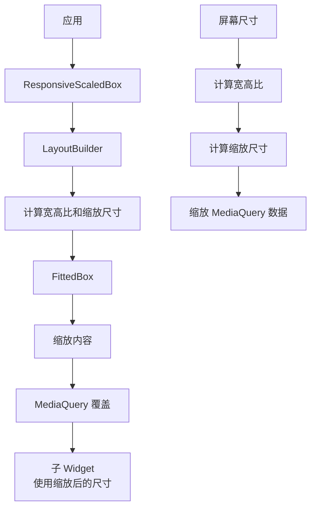

# ResponsiveScaledBox 代码讲解

## 概述

`ResponsiveScaledBox` 是响应式框架中用于按比例缩放内容的 Widget。它通过 `FittedBox` 实现内容的缩放，并根据宽高比计算缩放后的尺寸。更重要的是，它可以自动计算并覆盖 `MediaQuery` 数据，使子 Widget 认为屏幕尺寸就是缩放后的尺寸，这对于需要在固定尺寸下测试或显示的内容非常有用。

### 核心职责

1. **内容缩放**：根据指定的宽度和当前屏幕的宽高比缩放内容
2. **MediaQuery 覆盖**：自动计算并覆盖 `MediaQuery` 数据，使子 Widget 使用缩放后的尺寸
3. **比例计算**：按比例缩放视图插入（viewInsets）、视图内边距（viewPadding）和内边距（padding）
4. **宽高比保持**：保持内容的宽高比不变

### 在响应式框架中的位置

`ResponsiveScaledBox` 位于响应式布局工具层，用于内容缩放：



**数据流向**：

1. `ResponsiveScaledBox` 使用 `LayoutBuilder` 获取屏幕尺寸
2. 计算屏幕的宽高比
3. 根据目标宽度和宽高比计算缩放后的高度
4. 使用 `FittedBox` 缩放内容
5. 如果启用，计算并覆盖 `MediaQuery` 数据

### 与相关类的关系

- **LayoutBuilder**：Flutter 原生 Widget，提供布局约束
- **FittedBox**：Flutter 原生 Widget，实现内容缩放
- **MediaQuery**：Flutter 原生 Widget，提供屏幕信息

## 类定义和特性

### 类声明

```dart
class ResponsiveScaledBox extends StatelessWidget
```

`ResponsiveScaledBox` 继承自 `StatelessWidget`，是一个无状态的 Widget。

**设计特点**：

- **无状态设计**：每次构建时重新计算缩放，确保响应式更新
- **比例缩放**：保持宽高比，确保内容不变形
- **MediaQuery 覆盖**：使子 Widget 使用缩放后的尺寸

## 属性详解

### width

```dart
final double? width;
```

**作用**：目标宽度，内容会被缩放到此宽度。

**说明**：

- 类型为 `double?`，必需参数
- 如果为 `null`，不进行缩放，直接返回 `child`
- 缩放后的高度根据屏幕宽高比计算：`height = width / aspectRatio`

### child

```dart
final Widget child;
```

**作用**：要缩放的子 Widget。

**说明**：这是必需的参数，指定需要缩放的内容。

### autoCalculateMediaQueryData

```dart
final bool autoCalculateMediaQueryData;
```

**作用**：是否自动计算并覆盖 `MediaQuery` 数据。

**说明**：

- 默认值为 `true`
- 当 `true` 时，自动计算缩放后的 `MediaQuery` 数据并覆盖
- 当 `false` 时，只缩放内容，不覆盖 `MediaQuery`

**使用场景**：

- 需要子 Widget 使用缩放后的尺寸时设为 `true`
- 只需要视觉缩放时设为 `false`

## 构造函数

```dart
const ResponsiveScaledBox({
  super.key,
  required this.width,
  required this.child,
  this.autoCalculateMediaQueryData = true,
});
```

**参数说明**：

- `key`：Widget 的键
- `width`：必需的目标宽度
- `child`：必需的子 Widget
- `autoCalculateMediaQueryData`：是否自动计算 MediaQuery，默认为 `true`

## build() 方法详解

```dart
@override
Widget build(BuildContext context) {
  if (width != null) {
    return LayoutBuilder(
      builder: (context, constraints) {
        double aspectRatio = constraints.maxWidth / constraints.maxHeight;
        double scaledWidth = width!;
        double scaledHeight = width! / aspectRatio;

        Widget childHolder = FittedBox(
          fit: BoxFit.fitWidth,
          alignment: Alignment.topCenter,
          child: Container(
            width: width,
            height: scaledHeight,
            alignment: Alignment.center,
            child: child,
          ),
        );

        if (autoCalculateMediaQueryData) {
          MediaQueryData mediaQueryData = MediaQuery.of(context);

          bool overrideMediaQueryData = (mediaQueryData.size ==
              Size(constraints.maxWidth, constraints.maxHeight));

          EdgeInsets scaledViewInsets = getScaledViewInsets(
              mediaQueryData: mediaQueryData,
              screenSize: mediaQueryData.size,
              scaledSize: Size(scaledWidth, scaledHeight));
          EdgeInsets scaledViewPadding = getScaledViewPadding(
              mediaQueryData: mediaQueryData,
              screenSize: mediaQueryData.size,
              scaledSize: Size(scaledWidth, scaledHeight));
          EdgeInsets scaledPadding = getScaledPadding(
              padding: scaledViewPadding, insets: scaledViewInsets);

          if (overrideMediaQueryData) {
            return MediaQuery(
              data: mediaQueryData.copyWith(
                  size: Size(scaledWidth, scaledHeight),
                  viewInsets: scaledViewInsets,
                  viewPadding: scaledViewPadding,
                  padding: scaledPadding),
              child: childHolder,
            );
          }
        }

        return childHolder;
      },
    );
  }

  return child;
}
```

### 实现逻辑

1. **检查 width**：如果 `width` 为 `null`，直接返回 `child`

2. **使用 LayoutBuilder**：获取可用空间的约束

3. **计算宽高比和缩放尺寸**：

   ```dart
   double aspectRatio = constraints.maxWidth / constraints.maxHeight;
   double scaledWidth = width!;
   double scaledHeight = width! / aspectRatio;
   ```

4. **创建缩放容器**：
   - 使用 `FittedBox` 缩放内容
   - `fit: BoxFit.fitWidth` 确保宽度匹配
   - `alignment: Alignment.topCenter` 顶部居中对齐

5. **计算并覆盖 MediaQuery**（如果启用）：
   - 检查是否需要覆盖（屏幕尺寸是否匹配）
   - 计算缩放后的各种尺寸数据
   - 覆盖 `MediaQuery`

### 宽高比计算

```dart
double aspectRatio = constraints.maxWidth / constraints.maxHeight;
double scaledHeight = width! / aspectRatio;
```

**计算逻辑**：

- 宽高比 = 屏幕宽度 / 屏幕高度
- 缩放高度 = 目标宽度 / 宽高比

**示例**：

- 屏幕：1920x1080，宽高比 = 1.778
- 目标宽度：800
- 缩放高度：800 / 1.778 = 450

### FittedBox 缩放

```dart
FittedBox(
  fit: BoxFit.fitWidth,
  alignment: Alignment.topCenter,
  child: Container(
    width: width,
    height: scaledHeight,
    alignment: Alignment.center,
    child: child,
  ),
)
```

**说明**：

- `fit: BoxFit.fitWidth`：确保宽度匹配目标宽度
- `alignment: Alignment.topCenter`：顶部居中对齐
- `Container` 设置固定尺寸，`FittedBox` 负责缩放

### MediaQuery 覆盖检查

```dart
bool overrideMediaQueryData = (mediaQueryData.size ==
    Size(constraints.maxWidth, constraints.maxHeight));
```

**说明**：

- 只有当 `MediaQuery` 的尺寸与 `LayoutBuilder` 的约束匹配时才覆盖
- 这确保只在顶层覆盖，避免嵌套覆盖导致的问题

## 辅助方法详解

### getScaledViewInsets() 方法

```dart
EdgeInsets getScaledViewInsets({
  required MediaQueryData mediaQueryData,
  required Size screenSize,
  required Size scaledSize,
}) {
  double leftInsetFactor = mediaQueryData.viewInsets.left / screenSize.width;
  double topInsetFactor = mediaQueryData.viewInsets.top / screenSize.height;
  double rightInsetFactor = mediaQueryData.viewInsets.right / screenSize.width;
  double bottomInsetFactor = mediaQueryData.viewInsets.bottom / screenSize.height;

  double scaledLeftInset = leftInsetFactor * scaledSize.width;
  double scaledTopInset = topInsetFactor * scaledSize.height;
  double scaledRightInset = rightInsetFactor * scaledSize.width;
  double scaledBottomInset = bottomInsetFactor * scaledSize.height;

  return EdgeInsets.fromLTRB(
      scaledLeftInset, scaledTopInset, scaledRightInset, scaledBottomInset);
}
```

**作用**：计算缩放后的视图插入（viewInsets）。

**计算逻辑**：

1. **计算比例因子**：
   - `leftInsetFactor = viewInsets.left / screenSize.width`
   - 其他方向类似

2. **应用比例**：
   - `scaledLeftInset = leftInsetFactor * scaledSize.width`
   - 其他方向类似

**说明**：

- `viewInsets` 表示被系统 UI（如键盘）遮挡的区域
- 按比例缩放，保持相对位置不变

### getScaledViewPadding() 方法

```dart
EdgeInsets getScaledViewPadding({
  required MediaQueryData mediaQueryData,
  required Size screenSize,
  required Size scaledSize,
}) {
  double leftPaddingFactor = mediaQueryData.viewPadding.left / screenSize.width;
  double topPaddingFactor = mediaQueryData.viewPadding.top / screenSize.height;
  double rightPaddingFactor = mediaQueryData.viewPadding.right / screenSize.width;
  double bottomPaddingFactor = mediaQueryData.viewPadding.bottom / screenSize.height;

  scaledLeftPadding = leftPaddingFactor * scaledSize.width;
  scaledTopPadding = topPaddingFactor * scaledSize.height;
  scaledRightPadding = rightPaddingFactor * scaledSize.width;
  scaledBottomPadding = bottomPaddingFactor * scaledSize.height;

  return EdgeInsets.fromLTRB(scaledLeftPadding, scaledTopPadding,
      scaledRightPadding, scaledBottomPadding);
}
```

**作用**：计算缩放后的视图内边距（viewPadding）。

**计算逻辑**：与 `getScaledViewInsets()` 相同，按比例缩放。

**说明**：

- `viewPadding` 表示系统 UI（如状态栏、导航栏）占用的区域
- 按比例缩放，保持相对位置不变

### getScaledPadding() 方法

```dart
EdgeInsets getScaledPadding({
  required EdgeInsets padding,
  required EdgeInsets insets,
}) {
  scaledLeftPadding = max(0.0, padding.left - insets.left);
  scaledTopPadding = max(0.0, padding.top - insets.top);
  scaledRightPadding = max(0.0, padding.right - insets.right);
  scaledBottomPadding = max(0.0, padding.bottom - insets.bottom);

  return EdgeInsets.fromLTRB(scaledLeftPadding, scaledTopPadding,
      scaledRightPadding, scaledBottomPadding);
}
```

**作用**：计算缩放后的内边距（padding）。

**计算逻辑**：

- `scaledPadding = max(0.0, padding - insets)`
- 确保结果不为负数

**说明**：

- `padding` 是 `viewPadding` 减去 `viewInsets` 后的结果
- 表示实际可用的安全区域
- 使用 `max(0.0, ...)` 确保不为负数

## 使用示例

### 基本使用

```dart
ResponsiveScaledBox(
  width: 800,
  child: ContentWidget(),
)
```

### 响应式缩放

```dart
ResponsiveScaledBox(
  width: ResponsiveValue<double>(
    context,
    defaultValue: 600,
    conditionalValues: [
      Condition.equals(name: DESKTOP, value: 1200),
      Condition.equals(name: TABLET, value: 800),
      Condition.equals(name: MOBILE, value: 400),
    ],
  ).value,
  child: ContentWidget(),
)
```

### 禁用 MediaQuery 自动计算

```dart
ResponsiveScaledBox(
  width: 800,
  autoCalculateMediaQueryData: false,
  child: ContentWidget(),
)
```

### 固定尺寸内容显示

```dart
ResponsiveScaledBox(
  width: 375, // iPhone 标准宽度
  child: MobileAppPreview(),
)
```

### 响应式设计预览

```dart
ResponsiveScaledBox(
  width: ResponsiveValue<double>(
    context,
    defaultValue: 375,
    conditionalValues: [
      Condition.equals(name: DESKTOP, value: 1920),
      Condition.equals(name: TABLET, value: 768),
      Condition.equals(name: MOBILE, value: 375),
    ],
  ).value,
  child: AppPreview(),
)
```

## 设计模式和最佳实践

### 包装器模式

`ResponsiveScaledBox` 采用了包装器模式：

- **封装复杂性**：隐藏了缩放和 MediaQuery 计算的复杂性
- **简化 API**：提供简单的参数接口
- **保持兼容性**：完全兼容 Flutter 的布局系统

### 最佳实践建议

1. **合理设置目标宽度**：根据内容类型和设备类型设置合理的目标宽度

2. **使用响应式值**：结合 `ResponsiveValue` 为不同设备设置不同的目标宽度

3. **理解 MediaQuery 覆盖**：
   - 启用时，子 Widget 会使用缩放后的尺寸
   - 禁用时，只进行视觉缩放

4. **宽高比保持**：缩放会保持宽高比，确保内容不变形

5. **性能考虑**：
   - `ResponsiveScaledBox` 使用 `LayoutBuilder`，性能影响较小
   - MediaQuery 计算在每次构建时执行，但计算量不大

6. **使用场景**：
   - 固定尺寸内容显示
   - 设计预览
   - 响应式布局测试

## 常见使用场景

### 场景 1：移动应用预览

```dart
ResponsiveScaledBox(
  width: 375,
  child: MobileAppLayout(),
)
```

### 场景 2：响应式设计展示

```dart
ResponsiveScaledBox(
  width: ResponsiveValue<double>(
    context,
    defaultValue: 800,
    conditionalValues: [
      Condition.largerThan(name: DESKTOP, value: 1200),
      Condition.equals(name: TABLET, value: 800),
    ],
  ).value,
  child: DesignPreview(),
)
```

### 场景 3：固定尺寸容器

```dart
ResponsiveScaledBox(
  width: 600,
  autoCalculateMediaQueryData: true,
  child: FixedSizeContent(),
)
```

## 总结

`ResponsiveScaledBox` 是响应式框架中用于内容缩放的便捷工具，提供了：

1. **内容缩放**：根据目标宽度和屏幕宽高比缩放内容
2. **MediaQuery 覆盖**：自动计算并覆盖 MediaQuery 数据
3. **比例计算**：按比例缩放各种尺寸数据
4. **宽高比保持**：确保内容不变形
5. **易于使用**：简单的 API，易于理解和使用

理解 `ResponsiveScaledBox` 的设计和使用方法，有助于更好地构建响应式 Flutter 应用，实现内容缩放和固定尺寸显示的功能。
