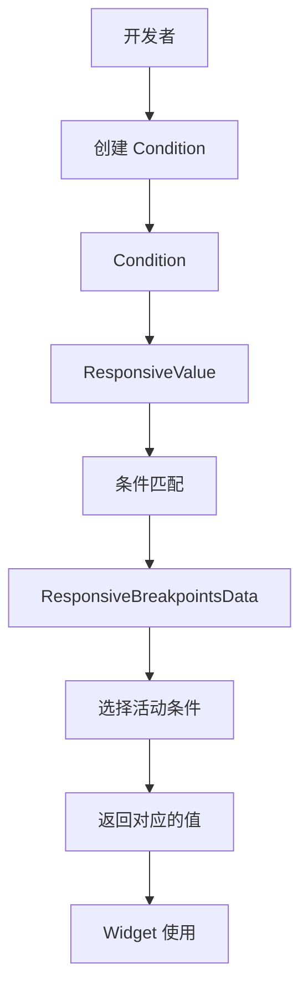

# Condition 代码讲解

## 概述

`Condition` 是响应式框架中的条件定义类，用于定义何时应用某个值。它是一个泛型类，可以关联任何类型的值，通过不同的条件类型（精确匹配、范围匹配、大小比较等）来判断条件是否满足。`Condition` 是 `ResponsiveValue` 的基础，所有响应式值的选择都依赖于条件列表。

### 核心职责

1. **条件定义**：定义何时应用某个值的条件
2. **值关联**：将条件与对应的值关联
3. **横竖屏支持**：支持为横竖屏提供不同的值
4. **类型安全**：通过泛型确保类型安全

### 在响应式框架中的位置

`Condition` 位于响应式系统的条件定义层，是值选择的基础：



**数据流向**：

1. 开发者创建 `Condition` 实例，定义条件和值
2. 将条件列表传递给 `ResponsiveValue`
3. `ResponsiveValue` 根据当前屏幕状态匹配条件
4. 选择活动条件，返回对应的值
5. Widget 使用计算得到的值

### 与相关类的关系

- **ResponsiveValue**：使用 `Condition` 列表进行值选择
- **Conditional**：枚举类型，定义条件类型（EQUALS、BETWEEN 等）
- **ResponsiveBreakpointsData**：提供屏幕状态信息，用于条件匹配
- **ResponsiveVisibility**：使用 `Condition<bool>` 控制可见性
- **ResponsiveConstraints**：使用 `Condition<BoxConstraints?>` 控制约束

## 类定义和特性

### 类声明

```dart
class Condition<T> {
  // ...
}
```

`Condition` 是一个泛型类，`T` 表示关联的值的类型。

**设计特点**：

- **泛型设计**：可以关联任何类型的值，提供类型安全
- **不可变对象**：所有字段都是 `final`，创建后不可修改
- **工厂构造函数**：提供便捷的创建方式
- **横竖屏支持**：支持为横竖屏提供不同的值

## 属性详解

### breakpointStart

```dart
final int? breakpointStart;
```

**作用**：断点起始值，用于范围或大小比较。

**说明**：

- 类型为 `int?`，可以为 `null`
- 用于 `BETWEEN`、`LARGER_THAN`、`SMALLER_THAN` 条件类型
- 对于 `BETWEEN` 条件，表示范围的起始值
- 对于 `LARGER_THAN` 和 `SMALLER_THAN`，表示比较的阈值

**使用场景**：

- 定义基于像素值的条件（而非命名断点）
- 用于 `BETWEEN` 条件定义范围
- 用于 `LARGER_THAN` 和 `SMALLER_THAN` 条件定义阈值

### breakpointEnd

```dart
final int? breakpointEnd;
```

**作用**：断点结束值，用于范围匹配。

**说明**：

- 类型为 `int?`，可以为 `null`
- 仅用于 `BETWEEN` 条件类型
- 与 `breakpointStart` 一起定义范围 `[breakpointStart, breakpointEnd]`

**使用场景**：

- 定义屏幕宽度的范围条件
- 与 `breakpointStart` 配合使用

### name

```dart
final String? name;
```

**作用**：断点名称，用于精确匹配。

**说明**：

- 类型为 `String?`，可以为 `null`
- 用于 `EQUALS` 条件类型（必需）
- 也可以用于 `LARGER_THAN` 和 `SMALLER_THAN` 条件类型（可选）
- 引用 `ResponsiveBreakpoints` 中定义的断点名称（如 `MOBILE`、`TABLET`、`DESKTOP`）

**使用场景**：

- 精确匹配特定断点
- 使用命名断点而非具体像素值，提高可维护性

### condition

```dart
final Conditional? condition;
```

**作用**：条件类型，定义如何匹配条件。

**说明**：

- 类型为 `Conditional?`，枚举类型
- 可能的值：`EQUALS`、`BETWEEN`、`SMALLER_THAN`、`LARGER_THAN`
- 决定条件匹配的逻辑

### value

```dart
final T? value;
```

**作用**：条件匹配时返回的值。

**说明**：

- 类型为 `T?`，与泛型参数一致
- 当条件匹配时，`ResponsiveValue` 会返回此值
- 可以为 `null`（取决于 `T` 的类型）

### landscapeValue

```dart
final T? landscapeValue;
```

**作用**：横屏时的值（可选）。

**说明**：

- 类型为 `T?`，与泛型参数一致
- 当屏幕方向为横屏且此值不为 `null` 时，优先使用此值
- 如果为 `null`，使用 `value`
- 默认值：如果未提供，使用 `value` 的值

**使用场景**：

- 为横竖屏提供不同的值
- 横屏时可能需要不同的布局、尺寸等

## Conditional 枚举

```dart
enum Conditional {
  LARGER_THAN,
  EQUALS,
  SMALLER_THAN,
  BETWEEN,
}
```

**作用**：定义条件类型的枚举。

**说明**：

- `EQUALS`：精确匹配断点名称（最高优先级）
- `BETWEEN`：屏幕宽度在范围内
- `SMALLER_THAN`：屏幕宽度小于指定值
- `LARGER_THAN`：屏幕宽度大于指定值（最低优先级）

**优先级顺序**：

在 `ResponsiveValue.getActiveCondition()` 中，条件按以下优先级匹配：

1. **EQUALS**（最高优先级）
2. **BETWEEN**
3. **SMALLER_THAN**
4. **LARGER_THAN**（最低优先级）

## 构造函数详解

### 私有构造函数 Condition._()

```dart
Condition._(
    {this.breakpointStart,
    this.breakpointEnd,
    this.name,
    this.condition,
    required this.value,
    T? landscapeValue})
    : landscapeValue = (landscapeValue ?? value),
      assert(breakpointStart != null || name != null),
      assert((condition == Conditional.EQUALS) ? name != null : true);
```

**作用**：私有构造函数，用于内部创建 `Condition` 实例。

**参数说明**：

- `breakpointStart`、`breakpointEnd`、`name`、`condition`：条件定义参数
- `value`：必需的值
- `landscapeValue`：可选的横屏值

**断言验证**：

1. **至少一个标识**：`breakpointStart != null || name != null`
   - 确保条件至少有一个标识（像素值或断点名称）

2. **EQUALS 需要名称**：`(condition == Conditional.EQUALS) ? name != null : true`
   - 如果条件类型是 `EQUALS`，`name` 必须不为 `null`

**landscapeValue 初始化**：

```dart
landscapeValue = (landscapeValue ?? value)
```

- 如果提供了 `landscapeValue`，使用提供的值
- 如果未提供（为 `null`），使用 `value` 作为默认值

### Condition.equals()

```dart
const Condition.equals({required this.name, this.value, T? landscapeValue})
    : landscapeValue = (landscapeValue ?? value),
      breakpointStart = null,
      breakpointEnd = null,
      condition = Conditional.EQUALS;
```

**作用**：创建精确匹配断点名称的条件。

**参数说明**：

- `name`：必需的断点名称（如 `MOBILE`、`TABLET`、`DESKTOP`）
- `value`：条件匹配时的值
- `landscapeValue`：可选的横屏值

**使用场景**：

- 精确匹配特定设备类型
- 使用命名断点，提高可维护性

**使用示例**：

```dart
Condition.equals(name: DESKTOP, value: '桌面值')
Condition.equals(name: TABLET, value: '平板值', landscapeValue: '横屏平板值')
```

### Condition.largerThan()

```dart
const Condition.largerThan(
    {int? breakpoint, this.name, this.value, T? landscapeValue})
    : landscapeValue = (landscapeValue ?? value),
      breakpointStart = breakpoint,
      breakpointEnd = breakpoint,
      condition = Conditional.LARGER_THAN;
```

**作用**：创建"大于"条件，当屏幕宽度大于指定值时匹配。

**参数说明**：

- `breakpoint`：可选的像素值阈值
- `name`：可选的断点名称（优先使用）
- `value`：条件匹配时的值
- `landscapeValue`：可选的横屏值

**匹配逻辑**：

- 如果提供了 `name`，使用 `ResponsiveBreakpointsData.largerThan(name)` 方法
- 如果未提供 `name` 但提供了 `breakpoint`，直接比较 `screenWidth > breakpoint`
- 优先使用命名断点，其次使用像素值

**使用场景**：

- 匹配大于某个尺寸的屏幕
- 定义"桌面及以上"的条件

**使用示例**：

```dart
Condition.largerThan(breakpoint: 1200, value: '大屏幕值')
Condition.largerThan(name: TABLET, value: '平板及以上值')
```

### Condition.smallerThan()

```dart
const Condition.smallerThan(
    {int? breakpoint, this.name, this.value, T? landscapeValue})
    : landscapeValue = (landscapeValue ?? value),
      breakpointStart = breakpoint,
      breakpointEnd = breakpoint,
      condition = Conditional.SMALLER_THAN;
```

**作用**：创建"小于"条件，当屏幕宽度小于指定值时匹配。

**参数说明**：

- `breakpoint`：可选的像素值阈值
- `name`：可选的断点名称（优先使用）
- `value`：条件匹配时的值
- `landscapeValue`：可选的横屏值

**匹配逻辑**：

- 如果提供了 `name`，使用 `ResponsiveBreakpointsData.smallerThan(name)` 方法
- 如果未提供 `name` 但提供了 `breakpoint`，直接比较 `screenWidth < breakpoint`
- 优先使用命名断点，其次使用像素值

**使用场景**：

- 匹配小于某个尺寸的屏幕
- 定义"移动设备"的条件

**使用示例**：

```dart
Condition.smallerThan(breakpoint: 600, value: '小屏幕值')
Condition.smallerThan(name: TABLET, value: '移动设备值')
```

### Condition.between()

```dart
/// Conditional when screen width is between [start] and [end] inclusive.
const Condition.between(
    {required int? start, required int? end, this.value, T? landscapeValue})
    : landscapeValue = (landscapeValue ?? value),
      breakpointStart = start,
      breakpointEnd = end,
      name = null,
      condition = Conditional.BETWEEN;
```

**作用**：创建范围条件，当屏幕宽度在指定范围内时匹配（包含边界）。

**参数说明**：

- `start`：必需的起始值
- `end`：必需的结束值
- `value`：条件匹配时的值
- `landscapeValue`：可选的横屏值

**匹配逻辑**：

- 检查 `screenWidth >= start && screenWidth <= end`
- 范围包含边界（inclusive）

**使用场景**：

- 匹配特定范围的屏幕尺寸
- 定义"中等屏幕"的条件

**使用示例**：

```dart
Condition.between(start: 600, end: 1200, value: '中等屏幕值')
Condition.between(start: 800, end: 1000, value: '特定范围值', landscapeValue: '横屏特定范围值')
```

## 方法详解

### copyWith() 方法

```dart
Condition<T> copyWith({
  int? breakpointStart,
  int? breakpointEnd,
  String? name,
  Conditional? condition,
  T? value,
  T? landscapeValue,
}) =>
    Condition<T>._(
      breakpointStart: breakpointStart ?? this.breakpointStart,
      breakpointEnd: breakpointEnd ?? this.breakpointEnd,
      name: name ?? this.name,
      condition: condition ?? this.condition,
      value: value ?? this.value,
      landscapeValue: landscapeValue ?? this.landscapeValue,
    );
```

**作用**：创建当前条件的副本，可以修改部分字段。

**参数说明**：

- 所有参数都是可选的
- 如果参数为 `null`，使用原条件的值
- 如果参数不为 `null`，使用新值

**使用场景**：

- 基于现有条件创建新条件
- 修改条件的值而不改变条件定义
- 在 `ResponsiveVisibility` 中，将 `visibleConditions` 转换为 `value: true` 的条件

**使用示例**：

```dart
final original = Condition.equals(name: DESKTOP, value: '原始值');
final modified = original.copyWith(value: '新值'); // 只修改值，保持条件不变
```

### toString() 方法

```dart
@override
String toString() =>
    'Condition(breakpointStart: $breakpointStart, breakpointEnd: $breakpointEnd, name: $name, condition: $condition, value: $value, landscapeValue: $landscapeValue)';
```

**作用**：返回条件的字符串表示，用于调试。

**返回值**：包含所有字段信息的字符串。

**使用场景**：

- 调试时打印条件信息
- 日志记录
- 开发工具显示

### sort() 方法

```dart
int sort(Condition a, Condition b) {
  if (a.breakpointStart == b.breakpointStart) return 0;

  return (a.breakpointStart! < b.breakpointStart!) ? -1 : 1;
}
```

**作用**：比较两个条件的排序顺序（基于 `breakpointStart`）。

**返回值**：

- `-1`：`a` 应该排在 `b` 之前
- `0`：`a` 和 `b` 相等
- `1`：`a` 应该排在 `b` 之后

**说明**：

- 基于 `breakpointStart` 进行比较
- 如果 `breakpointStart` 相等，返回 `0`
- 如果 `a.breakpointStart < b.breakpointStart`，返回 `-1`（`a` 在前）
- 否则返回 `1`（`b` 在前）

**使用场景**：

- 对条件列表进行排序
- 确保条件按 `breakpointStart` 顺序排列

**注意事项**：

- 此方法假设 `breakpointStart` 不为 `null`
- 主要用于 `BETWEEN` 条件，其他条件类型可能 `breakpointStart` 为 `null`

## 使用示例

### 精确匹配（EQUALS）

```dart
// 匹配桌面设备
Condition.equals(name: DESKTOP, value: '桌面值')

// 匹配平板设备，横竖屏不同值
Condition.equals(
  name: TABLET,
  value: '竖屏平板值',
  landscapeValue: '横屏平板值',
)
```

### 大于条件（LARGER_THAN）

```dart
// 使用像素值
Condition.largerThan(breakpoint: 1200, value: '大屏幕值')

// 使用命名断点（推荐）
Condition.largerThan(name: TABLET, value: '平板及以上值')

// 横竖屏不同值
Condition.largerThan(
  breakpoint: 1000,
  value: '竖屏大屏幕值',
  landscapeValue: '横屏大屏幕值',
)
```

### 小于条件（SMALLER_THAN）

```dart
// 使用像素值
Condition.smallerThan(breakpoint: 600, value: '小屏幕值')

// 使用命名断点（推荐）
Condition.smallerThan(name: TABLET, value: '移动设备值')

// 横竖屏不同值
Condition.smallerThan(
  name: TABLET,
  value: '竖屏移动值',
  landscapeValue: '横屏移动值',
)
```

### 范围条件（BETWEEN）

```dart
// 定义范围
Condition.between(start: 600, end: 1200, value: '中等屏幕值')

// 横竖屏不同值
Condition.between(
  start: 800,
  end: 1000,
  value: '竖屏特定范围值',
  landscapeValue: '横屏特定范围值',
)
```

### 在 ResponsiveValue 中使用

```dart
final value = ResponsiveValue<String>(
  context,
  defaultValue: '默认值',
  conditionalValues: [
    Condition.equals(name: DESKTOP, value: '桌面值'),
    Condition.equals(name: TABLET, value: '平板值'),
    Condition.smallerThan(name: TABLET, value: '移动值'),
  ],
).value;
```

### 在 ResponsiveVisibility 中使用

```dart
ResponsiveVisibility(
  visibleConditions: [
    Condition.equals(name: DESKTOP),
    Condition.largerThan(name: TABLET),
  ],
  hiddenConditions: [
    Condition.smallerThan(breakpoint: 600),
  ],
  child: AdaptiveWidget(),
)
```

### 在 ResponsiveConstraints 中使用

```dart
ResponsiveConstraints(
  conditionalConstraints: [
    Condition.equals(
      name: DESKTOP,
      value: BoxConstraints(maxWidth: 1200),
    ),
    Condition.between(
      start: 600,
      end: 1200,
      value: BoxConstraints(maxWidth: 800),
    ),
    Condition.smallerThan(
      breakpoint: 600,
      value: BoxConstraints(maxWidth: double.infinity),
    ),
  ],
  child: ContentWidget(),
)
```

### 复杂条件组合

```dart
final fontSize = ResponsiveValue<double>(
  context,
  defaultValue: 14,
  conditionalValues: [
    // 精确匹配：桌面
    Condition.equals(name: DESKTOP, value: 18),
    // 大于：超大屏幕
    Condition.largerThan(breakpoint: 1920, value: 20),
    // 范围：中等屏幕
    Condition.between(start: 800, end: 1200, value: 16),
    // 小于：移动设备
    Condition.smallerThan(name: TABLET, value: 12),
  ],
).value;
```

### 横竖屏不同值

```dart
final maxWidth = ResponsiveValue<double>(
  context,
  defaultValue: 600,
  conditionalValues: [
    Condition.equals(
      name: TABLET,
      value: 800,        // 竖屏：800
      landscapeValue: 1200, // 横屏：1200
    ),
    Condition.between(
      start: 600,
      end: 900,
      value: 700,
      landscapeValue: 1000, // 横屏时使用更大的值
    ),
  ],
).value;
```

## 设计模式和最佳实践

### 工厂模式

`Condition` 采用了工厂模式：

- **多种创建方式**：提供 `equals`、`largerThan`、`smallerThan`、`between` 等工厂方法
- **简化创建**：隐藏私有构造函数的复杂性
- **类型安全**：通过工厂方法确保参数有效性

### 不可变对象模式

`Condition` 是不可变对象：

- **所有字段都是 final**：创建后不可修改
- **copyWith 方法**：需要修改时创建新实例
- **线程安全**：多个地方可以安全地共享同一个实例

### 最佳实践建议

1. **优先使用命名断点**：使用 `Condition.equals(name: DESKTOP)` 而非具体的像素值，提高可维护性

2. **理解优先级**：理解条件的优先级规则，合理组织条件列表

3. **使用横竖屏支持**：利用 `landscapeValue` 为横竖屏提供不同的值

4. **合理使用条件类型**：
   - 精确匹配使用 `EQUALS`
   - 范围匹配使用 `BETWEEN`
   - 阈值比较使用 `LARGER_THAN` 或 `SMALLER_THAN`

5. **避免条件冲突**：确保条件定义清晰，避免多个条件同时匹配导致的不确定性

6. **使用 const 构造函数**：所有工厂构造函数都是 `const`，可以创建编译时常量

7. **类型安全**：充分利用泛型，确保类型安全

8. **测试覆盖**：在不同屏幕尺寸和设备类型上测试条件匹配

## 常见问题和解决方案

### 问题 1：条件始终不匹配

**原因**：条件定义不正确或断点名称错误。

**解决方案**：

- 检查条件定义是否正确
- 确认断点名称是否正确（使用常量而非字符串字面量）
- 使用调试工具查看当前屏幕宽度和断点

### 问题 2：多个条件都匹配

**原因**：不理解优先级规则。

**解决方案**：

- 理解优先级规则：EQUALS > BETWEEN > SMALLER_THAN > LARGER_THAN
- 使用更精确的条件类型（如 EQUALS 而非 LARGER_THAN）
- 调整条件列表的顺序

### 问题 3：横竖屏值不生效

**原因**：`landscapeValue` 未正确设置或方向判断错误。

**解决方案**：

- 确保设置了 `landscapeValue` 参数
- 确认当前方向确实是横屏
- 检查 `ResponsiveBreakpoints` 的横屏支持配置

## 总结

`Condition` 是响应式框架中的条件定义类，提供了：

1. **灵活的条件类型**：支持精确匹配、范围匹配、大小比较等多种条件类型
2. **类型安全**：通过泛型确保类型安全
3. **横竖屏支持**：支持为横竖屏提供不同的值
4. **易于使用**：工厂构造函数提供便捷的创建方式
5. **不可变设计**：线程安全，可以安全共享

理解 `Condition` 的设计和使用方法，有助于更好地构建响应式 Flutter 应用，实现根据设备类型和屏幕尺寸动态调整值的功能。
