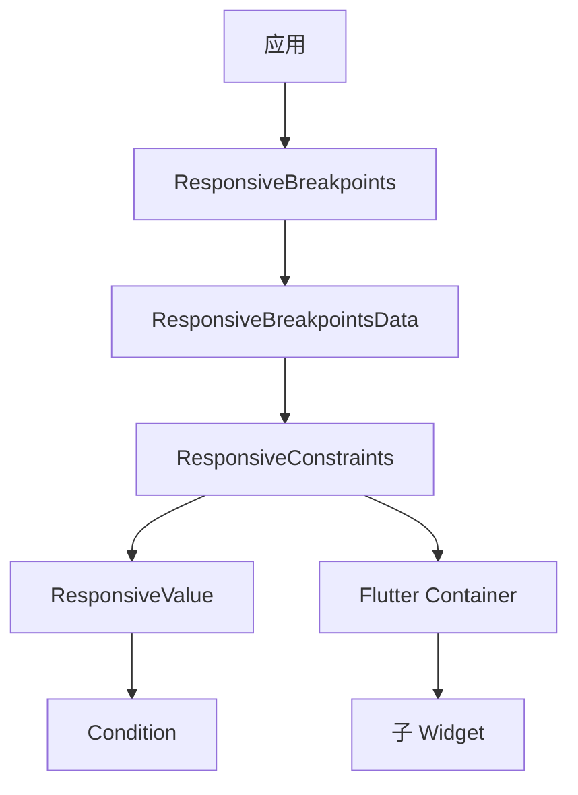

# ResponsiveConstraints 代码讲解

## 概述

`ResponsiveConstraints` 是响应式框架中用于应用响应式布局约束的 Widget。它基于 Flutter 的 `BoxConstraints`，通过 `Condition` 和 `ResponsiveValue` 实现根据屏幕断点、设备类型等条件动态应用不同的布局约束。

### 核心职责

1. **响应式约束控制**：根据屏幕尺寸、断点、设备类型等条件应用不同的布局约束
2. **条件管理**：支持通过 `conditionalConstraints` 定义不同条件下的约束值
3. **便捷包装**：简化响应式约束的应用，提供更直观的 API
4. **布局适配**：帮助实现响应式的宽度、高度、最小/最大尺寸等约束

### 在响应式框架中的位置

`ResponsiveConstraints` 位于响应式 Widget 层，依赖于核心响应式系统：



**数据流向**：

1. `ResponsiveBreakpoints` 提供响应式数据
2. `ResponsiveConstraints` 使用 `ResponsiveValue` 评估条件
3. `ResponsiveValue` 根据 `Condition` 列表选择活动条件
4. 最终通过 `Container` Widget 应用约束到子 Widget

### 与相关类的关系

- **Container**：Flutter 原生 Widget，提供约束应用功能
- **BoxConstraints**：Flutter 的约束类，定义 Widget 的尺寸限制
- **ResponsiveValue**：响应式值类，根据条件选择对应的约束值
- **Condition**：条件定义类，定义何时应用某个约束
- **ResponsiveBreakpointsData**：响应式数据源，提供屏幕尺寸、断点等信息

## 类定义和特性

### 类声明

```dart
class ResponsiveConstraints extends StatelessWidget
```

`ResponsiveConstraints` 继承自 `StatelessWidget`，是一个无状态的 Widget。

**设计特点**：

- **无状态设计**：每次构建时重新计算约束，确保响应式更新
- **便捷包装器**：封装了 `Container` 和 `ResponsiveValue` 的复杂逻辑
- **声明式 API**：通过条件列表声明式地定义约束规则

## 属性详解

### child

```dart
final Widget child;
```

**作用**：要应用约束的子 Widget。

**说明**：这是必需的参数，指定需要应用响应式约束的 Widget。

### constraint

```dart
final BoxConstraints? constraint;
```

**作用**：默认约束值。

**说明**：

- 类型为 `BoxConstraints?`，可以为 `null`
- 当没有条件匹配时，使用此约束
- 作为 `ResponsiveValue` 的 `defaultValue` 使用

**BoxConstraints 说明**：

`BoxConstraints` 定义了 Widget 的尺寸限制：

- `minWidth`、`maxWidth`：宽度范围
- `minHeight`、`maxHeight`：高度范围
- `isTight`：是否为严格约束（min = max）
- `isLoose`：是否为宽松约束（有范围）

**使用场景**：

- 设置默认的最大宽度
- 设置默认的最小高度
- 提供基础约束，条件约束在此基础上调整

### conditionalConstraints

```dart
final List<Condition<BoxConstraints?>> conditionalConstraints;
```

**作用**：定义不同条件下的约束列表。

**说明**：

- 类型为 `List<Condition<BoxConstraints?>>`，每个条件返回 `BoxConstraints?` 值
- 当条件匹配时，应用对应的约束
- 支持多种条件类型：`equals`、`largerThan`、`smallerThan`、`between`

**条件类型**：

- `Condition.equals`：当断点名称等于指定值时应用约束
- `Condition.largerThan`：当屏幕宽度大于指定值时应用约束
- `Condition.smallerThan`：当屏幕宽度小于指定值时应用约束
- `Condition.between`：当屏幕宽度在指定范围内时应用约束

**约束优先级**：

- 如果多个条件匹配，`ResponsiveValue` 会根据优先级选择（EQUALS > BETWEEN > SMALLER_THAN > LARGER_THAN）
- 后添加的条件优先级更高（列表反转后遍历）

**使用示例**：

```dart
ResponsiveConstraints(
  conditionalConstraints: [
    Condition.equals(
      name: DESKTOP,
      value: BoxConstraints(maxWidth: 1200),
    ),
    Condition.smallerThan(
      name: TABLET,
      value: BoxConstraints(maxWidth: 600),
    ),
  ],
  child: ContentWidget(),
)
```

## 构造函数

```dart
const ResponsiveConstraints({
  super.key,
  required this.child,
  this.constraint,
  this.conditionalConstraints = const [],
});
```

**参数说明**：

- `key`：Widget 的键，用于 Widget 树中的识别
- `child`：必需的子 Widget
- `constraint`：默认约束，可以为 `null`
- `conditionalConstraints`：条件约束列表，默认为空列表

**设计特点**：

- 所有参数都有合理的默认值
- 使用 `const` 构造函数，支持编译时常量
- 参数命名清晰，易于理解

## build() 方法详解

```dart
@override
Widget build(BuildContext context) {
  // Initialize mutable value holders.
  BoxConstraints? constraintValue = constraint;
  // Get value from active condition.
  constraintValue = ResponsiveValue<BoxConstraints?>(context,
          defaultValue: constraintValue,
          conditionalValues: conditionalConstraints)
      .value;

  return Container(
    constraints: constraintValue,
    child: child,
  );
}
```

### 实现逻辑

1. **初始化变量**：
   - 使用 `constraint` 作为默认约束值

2. **计算约束**：
   - 创建 `ResponsiveValue<BoxConstraints?>` 实例
   - 传入默认约束和条件约束列表
   - 获取活动条件的值作为最终约束

3. **创建 Container Widget**：
   - 使用计算得到的 `constraintValue`
   - 通过 `Container` 的 `constraints` 属性应用约束
   - 返回 `Container` Widget

### ResponsiveValue 的使用

`ResponsiveValue` 会根据以下优先级选择活动条件：

1. **EQUALS**：精确匹配断点名称
2. **BETWEEN**：屏幕宽度在范围内
3. **SMALLER_THAN**：屏幕宽度小于指定值
4. **LARGER_THAN**：屏幕宽度大于指定值

如果多个条件匹配，选择优先级最高的。如果列表中有多个相同优先级的条件，后添加的（在列表中靠后的）会被优先选择（因为列表会反转遍历）。

### Container 约束应用

`Container` Widget 的 `constraints` 属性会限制子 Widget 的尺寸：

- 子 Widget 必须遵守这些约束
- 如果约束为 `null`，不应用任何约束
- 约束会影响子 Widget 的布局和尺寸计算

## 使用示例

### 基本使用

```dart
ResponsiveConstraints(
  constraint: BoxConstraints(maxWidth: 800),
  child: ContentWidget(),
)
```

### 根据设备类型应用约束

```dart
ResponsiveConstraints(
  conditionalConstraints: [
    Condition.equals(
      name: DESKTOP,
      value: BoxConstraints(maxWidth: 1200),
    ),
    Condition.equals(
      name: TABLET,
      value: BoxConstraints(maxWidth: 800),
    ),
    Condition.equals(
      name: MOBILE,
      value: BoxConstraints(maxWidth: 400),
    ),
  ],
  child: ContentWidget(),
)
```

### 根据屏幕尺寸应用约束

```dart
ResponsiveConstraints(
  constraint: BoxConstraints(maxWidth: 600), // 默认值
  conditionalConstraints: [
    Condition.largerThan(breakpoint: 1200, value: BoxConstraints(maxWidth: 1200)),
    Condition.largerThan(breakpoint: 800, value: BoxConstraints(maxWidth: 800)),
  ],
  child: ContentWidget(),
)
```

### 响应式最大宽度

```dart
ResponsiveConstraints(
  conditionalConstraints: [
    Condition.largerThan(
      name: DESKTOP,
      value: BoxConstraints(maxWidth: 1400),
    ),
    Condition.largerThan(
      name: TABLET,
      value: BoxConstraints(maxWidth: 900),
    ),
    Condition.smallerThan(
      name: TABLET,
      value: BoxConstraints(maxWidth: double.infinity), // 移动端无限制
    ),
  ],
  child: ContentWidget(),
)
```

### 响应式最小和最大尺寸

```dart
ResponsiveConstraints(
  conditionalConstraints: [
    Condition.equals(
      name: DESKTOP,
      value: BoxConstraints(
        minWidth: 800,
        maxWidth: 1200,
        minHeight: 600,
        maxHeight: 800,
      ),
    ),
    Condition.equals(
      name: TABLET,
      value: BoxConstraints(
        minWidth: 400,
        maxWidth: 800,
        minHeight: 400,
        maxHeight: 600,
      ),
    ),
  ],
  child: ContentWidget(),
)
```

### 横竖屏不同约束

```dart
ResponsiveConstraints(
  conditionalConstraints: [
    Condition.equals(
      name: TABLET,
      value: BoxConstraints(maxWidth: 800),
      landscapeValue: BoxConstraints(maxWidth: 1200), // 横屏时更宽
    ),
  ],
  child: ContentWidget(),
)
```

### 组合多个条件

```dart
ResponsiveConstraints(
  constraint: BoxConstraints(maxWidth: 600), // 默认约束
  conditionalConstraints: [
    // 桌面端：最大宽度 1400
    Condition.equals(
      name: DESKTOP,
      value: BoxConstraints(maxWidth: 1400),
    ),
    // 平板端：最大宽度 900
    Condition.equals(
      name: TABLET,
      value: BoxConstraints(maxWidth: 900),
    ),
    // 大屏幕：最大宽度 1600
    Condition.largerThan(breakpoint: 1600, value: BoxConstraints(maxWidth: 1600)),
  ],
  child: ContentWidget(),
)
```

### 响应式卡片布局

```dart
ResponsiveConstraints(
  conditionalConstraints: [
    Condition.equals(
      name: DESKTOP,
      value: BoxConstraints(
        maxWidth: 300,
        minHeight: 200,
      ),
    ),
    Condition.equals(
      name: TABLET,
      value: BoxConstraints(
        maxWidth: 250,
        minHeight: 180,
      ),
    ),
    Condition.equals(
      name: MOBILE,
      value: BoxConstraints(
        maxWidth: double.infinity, // 移动端占满宽度
        minHeight: 150,
      ),
    ),
  ],
  child: Card(
    child: CardContent(),
  ),
)
```

### 响应式容器

```dart
ResponsiveConstraints(
  conditionalConstraints: [
    Condition.between(
      start: 800,
      end: 1200,
      value: BoxConstraints(
        maxWidth: 1000,
        minWidth: 800,
      ),
    ),
  ],
  child: Container(
    decoration: BoxDecoration(color: Colors.blue),
    child: ContentWidget(),
  ),
)
```

### 响应式侧边栏宽度

```dart
ResponsiveConstraints(
  conditionalConstraints: [
    Condition.largerThan(
      name: DESKTOP,
      value: BoxConstraints(
        minWidth: 250,
        maxWidth: 300,
      ),
    ),
    Condition.equals(
      name: TABLET,
      value: BoxConstraints(
        minWidth: 200,
        maxWidth: 250,
      ),
    ),
    Condition.smallerThan(
      name: TABLET,
      value: BoxConstraints(
        minWidth: 0,
        maxWidth: 0, // 移动端隐藏侧边栏
      ),
    ),
  ],
  child: Sidebar(),
)
```

### 响应式内容区域

```dart
ResponsiveConstraints(
  constraint: BoxConstraints(maxWidth: 600), // 默认最大宽度
  conditionalConstraints: [
    Condition.largerThan(breakpoint: 1920, value: BoxConstraints(maxWidth: 1600)),
    Condition.largerThan(breakpoint: 1440, value: BoxConstraints(maxWidth: 1200)),
    Condition.largerThan(breakpoint: 1024, value: BoxConstraints(maxWidth: 900)),
  ],
  child: MainContent(),
)
```

## 设计模式和最佳实践

### 包装器模式

`ResponsiveConstraints` 采用了包装器模式：

- **封装复杂性**：隐藏了 `ResponsiveValue` 和条件管理的复杂性
- **简化 API**：提供更直观的 `conditionalConstraints` 参数
- **保持兼容性**：完全兼容 `BoxConstraints` 的所有功能

### 条件值模式

通过 `ResponsiveValue` 实现条件值模式：

- **声明式定义**：通过条件列表声明式地定义约束规则
- **自动评估**：框架自动评估条件并选择活动值
- **响应式更新**：当屏幕尺寸变化时自动重新评估

### 最佳实践建议

1. **优先使用设备类型**：使用 `Condition.equals(name: DESKTOP)` 而非具体的像素值，提高可维护性

2. **设置合理的默认值**：通过 `constraint` 参数设置合理的默认约束，作为后备方案

3. **理解约束优先级**：理解条件的优先级，合理组织条件列表

4. **使用 BoxConstraints 常量**：
   - `BoxConstraints.tight(Size)`：创建严格约束
   - `BoxConstraints.loose(Size)`：创建宽松约束
   - `BoxConstraints.expand()`：创建扩展约束

5. **性能考虑**：
   - 约束变化会触发子 Widget 重建
   - 避免过于频繁的约束变化
   - 合理使用 `maxWidth` 和 `minWidth` 平衡布局和性能

6. **布局测试**：在不同屏幕尺寸和设备类型上测试约束效果

7. **约束组合**：可以组合多个约束条件，但要保持逻辑清晰

8. **使用横竖屏支持**：利用 `landscapeValue` 参数为横竖屏提供不同的约束

## 常见使用场景

### 场景 1：响应式内容宽度

```dart
ResponsiveConstraints(
  conditionalConstraints: [
    Condition.equals(name: DESKTOP, value: BoxConstraints(maxWidth: 1200)),
    Condition.equals(name: TABLET, value: BoxConstraints(maxWidth: 800)),
    Condition.equals(name: MOBILE, value: BoxConstraints(maxWidth: double.infinity)),
  ],
  child: ArticleContent(),
)
```

### 场景 2：响应式卡片网格

```dart
ResponsiveConstraints(
  conditionalConstraints: [
    Condition.largerThan(
      name: DESKTOP,
      value: BoxConstraints(maxWidth: 300), // 桌面端固定宽度
    ),
    Condition.equals(
      name: TABLET,
      value: BoxConstraints(maxWidth: 250), // 平板端稍窄
    ),
  ],
  child: ProductCard(),
)
```

### 场景 3：响应式对话框

```dart
ResponsiveConstraints(
  conditionalConstraints: [
    Condition.largerThan(
      name: TABLET,
      value: BoxConstraints(
        maxWidth: 500,
        maxHeight: 600,
      ),
    ),
    Condition.smallerThan(
      name: TABLET,
      value: BoxConstraints(
        maxWidth: double.infinity, // 移动端全屏
        maxHeight: double.infinity,
      ),
    ),
  ],
  child: DialogContent(),
)
```

### 场景 4：响应式表单

```dart
ResponsiveConstraints(
  conditionalConstraints: [
    Condition.equals(
      name: DESKTOP,
      value: BoxConstraints(maxWidth: 600),
    ),
    Condition.equals(
      name: TABLET,
      value: BoxConstraints(maxWidth: 500),
    ),
    Condition.equals(
      name: MOBILE,
      value: BoxConstraints(maxWidth: double.infinity),
    ),
  ],
  child: FormWidget(),
)
```

## BoxConstraints 补充说明

### 约束类型

1. **宽松约束（Loose）**：

   ```dart
   BoxConstraints(minWidth: 0, maxWidth: 100, minHeight: 0, maxHeight: 100)
   ```

   - Widget 可以在范围内自由选择尺寸

2. **严格约束（Tight）**：

   ```dart
   BoxConstraints.tight(Size(100, 100))
   ```

   - Widget 必须使用精确的尺寸

3. **无界约束（Unbounded）**：

   ```dart
   BoxConstraints(maxWidth: double.infinity, maxHeight: double.infinity)
   ```

   - Widget 可以扩展到任意大小

### 约束应用规则

- 子 Widget 必须遵守父 Widget 的约束
- 子 Widget 可以请求更小的尺寸，但不能超过最大值
- 子 Widget 可以请求更大的尺寸，但不能小于最小值
- 如果约束冲突，Flutter 会尝试找到最佳解决方案

## 总结

`ResponsiveConstraints` 是响应式框架中用于应用响应式布局约束的便捷工具，提供了：

1. **声明式 API**：通过条件列表声明式地定义约束规则
2. **灵活的条件系统**：支持多种条件类型和组合
3. **完整的 BoxConstraints 支持**：支持所有 `BoxConstraints` 的功能
4. **响应式更新**：自动响应屏幕尺寸变化
5. **易于使用**：简化的 API，降低使用复杂度

理解 `ResponsiveConstraints` 的设计和使用方法，有助于更好地构建响应式 Flutter 应用，实现根据设备类型和屏幕尺寸动态调整布局约束的功能。
