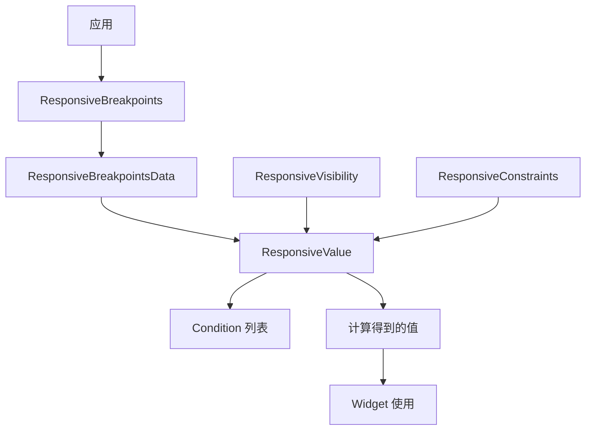
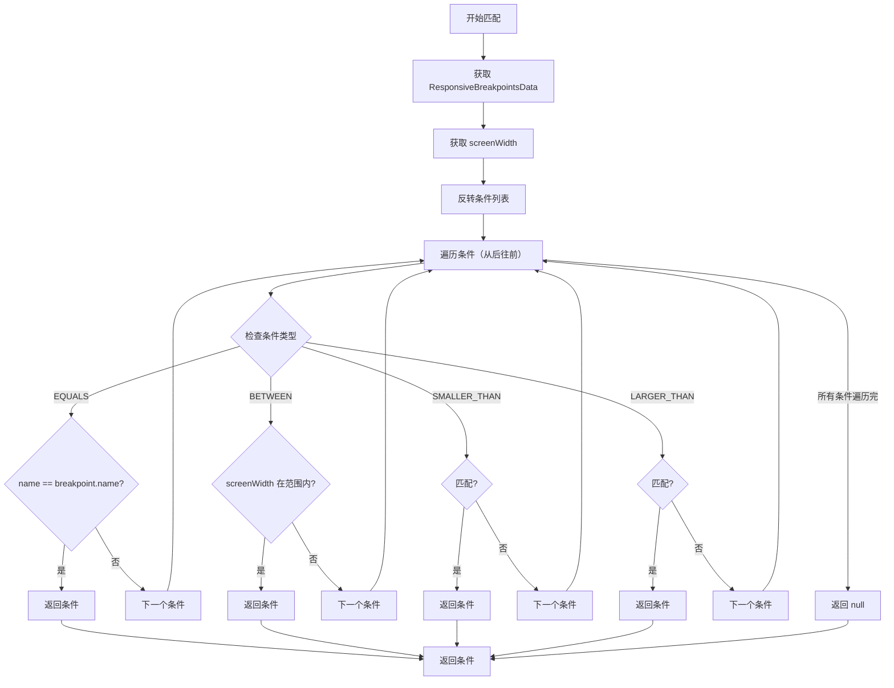

# ResponsiveValue 代码讲解

## 概述

`ResponsiveValue` 是响应式框架中的核心值计算器，用于根据屏幕断点、设备类型等条件动态选择对应的值。它是一个泛型类，可以处理任何类型的值（如 `bool`、`BoxConstraints`、`int`、`String` 等），通过 `Condition` 列表定义不同条件下的值，并根据当前屏幕状态自动选择匹配的值。

### 核心职责

1. **条件值计算**：根据当前屏幕状态从多个条件中选择匹配的值
2. **条件优先级管理**：按照预定义的优先级规则选择活动条件
3. **横竖屏支持**：支持为横竖屏提供不同的值
4. **类型安全**：通过泛型确保类型安全

### 在响应式框架中的位置

`ResponsiveValue` 位于响应式系统的核心层，连接条件定义和值使用：



**数据流向**：

1. `ResponsiveBreakpoints` 提供响应式数据（屏幕尺寸、断点等）
2. `ResponsiveValue` 接收条件列表和默认值
3. 根据当前屏幕状态匹配条件，选择活动条件
4. 返回活动条件的值（考虑横竖屏）
5. Widget（如 `ResponsiveVisibility`、`ResponsiveConstraints`）使用计算得到的值

### 与相关类的关系

- **Condition**：条件定义类，定义何时应用某个值
- **ResponsiveBreakpointsData**：响应式数据源，提供屏幕尺寸、断点等信息
- **ResponsiveVisibility**：使用 `ResponsiveValue<bool>` 控制可见性
- **ResponsiveConstraints**：使用 `ResponsiveValue<BoxConstraints?>` 控制约束

## 类定义和特性

### 类声明

```dart
class ResponsiveValue<T> {
  // ...
}
```

`ResponsiveValue` 是一个泛型类，`T` 表示值的类型。

**设计特点**：

- **泛型设计**：可以处理任何类型的值，提供类型安全
- **非 Widget 类**：不是 Widget，是值计算器，在 Widget 的 `build()` 方法中使用
- **即时计算**：在构造函数中立即计算值，而非延迟计算
- **不可变结果**：计算得到的值存储在 `value` 字段中，不会改变

## 属性详解

### value

```dart
late T value;
```

**作用**：计算得到的最终值。

**说明**：

- 使用 `late` 关键字，在构造函数中初始化
- 类型为 `T`，与泛型参数一致
- 如果条件匹配，使用活动条件的值；否则使用 `defaultValue`
- 考虑横竖屏：如果处于横屏且有 `landscapeValue`，优先使用横屏值

### defaultValue

```dart
final T? defaultValue;
```

**作用**：当没有条件匹配时使用的默认值。

**说明**：

- 类型为 `T?`，可以为 `null`
- 当所有条件都不匹配时，使用此值
- 如果为 `null` 且没有条件匹配，`value` 可能为 `null`（取决于 `T` 的类型）

**使用场景**：

- 提供后备值，确保总是有值可用
- 定义默认行为，当没有特定条件时使用

### conditionalValues

```dart
final List<Condition<T>> conditionalValues;
```

**作用**：条件值列表，定义不同条件下的值。

**说明**：

- 类型为 `List<Condition<T>>`，每个条件包含条件和对应的值
- 条件按优先级匹配，优先级高的条件优先
- 如果多个条件匹配，选择优先级最高的
- 列表中的顺序影响优先级（后添加的条件优先级更高）

### context

```dart
final BuildContext context;
```

**作用**：构建上下文，用于访问响应式数据。

**说明**：

- 用于调用 `ResponsiveBreakpoints.of(context)` 获取响应式数据
- 必须在 Widget 树中存在 `ResponsiveBreakpoints` 才能使用
- 在构造函数中会检查断点引用是否有效

## 构造函数详解

```dart
ResponsiveValue(this.context,
    {required this.conditionalValues, this.defaultValue}) {
  // Breakpoint reference check. Verify a parent
  // [ResponsiveBreakpoint] exists if a reference is found.
  if (conditionalValues.firstWhereOrNull((element) => element.name != null) !=
      null) {
    try {
      ResponsiveBreakpoints.of(context);
    } catch (e) {
      throw FlutterError.fromParts(<DiagnosticsNode>[
        ErrorSummary(
            'A conditional value was caught referencing a nonexistent breakpoint.'),
        ErrorDescription(
            'ResponsiveValue requires a parent ResponsiveBreakpoint '
            'to reference breakpoints. Add a ResponsiveBreakpoint or remove breakpoint references.')
      ]);
    }
  }

  List<Condition> conditions = [];
  conditions.addAll(conditionalValues);
  // Get visible value from active condition.
  value = (getValue(context, conditions) ?? defaultValue) as T;
}
```

### 参数说明

- `context`：必需的构建上下文
- `conditionalValues`：必需的条件值列表
- `defaultValue`：可选的默认值

### 断点引用检查

在构造函数中，会检查条件列表中是否有引用断点名称的条件：

```dart
if (conditionalValues.firstWhereOrNull((element) => element.name != null) != null) {
  try {
    ResponsiveBreakpoints.of(context);
  } catch (e) {
    throw FlutterError.fromParts([...]);
  }
}
```

**检查逻辑**：

1. 查找是否有条件的 `name` 不为 `null`（即引用了断点名称）
2. 如果找到，尝试获取 `ResponsiveBreakpoints`
3. 如果获取失败（抛出异常），说明 Widget 树中没有 `ResponsiveBreakpoints`
4. 抛出友好的错误信息，提示用户添加 `ResponsiveBreakpoints` 或移除断点引用

**设计意图**：

- 提前发现配置错误，避免运行时问题
- 提供清晰的错误信息，帮助开发者快速定位问题

### 值计算流程

1. **复制条件列表**：创建条件列表的副本（虽然这里直接使用原列表也可以）
2. **调用 getValue()**：传入上下文和条件列表，获取匹配条件的值
3. **使用默认值**：如果 `getValue()` 返回 `null`，使用 `defaultValue`
4. **类型转换**：将结果转换为 `T` 类型并赋值给 `value`

## 方法详解

### getValue() 方法

```dart
T? getValue(BuildContext context, List<Condition> conditions) {
  // Find the active condition.
  Condition? activeCondition = getActiveCondition(context, conditions);
  if (activeCondition == null) return null;
  // Return landscape value if orientation is landscape and landscape override value is provided.
  if (ResponsiveBreakpoints.of(context).orientation ==
          Orientation.landscape &&
      activeCondition.landscapeValue != null) {
    return activeCondition.landscapeValue;
  }
  // Return active condition value or default value if null.
  return activeCondition.value;
}
```

**作用**：根据条件列表获取匹配条件的值。

**实现逻辑**：

1. **查找活动条件**：调用 `getActiveCondition()` 查找匹配的条件
2. **检查横竖屏**：如果处于横屏且条件有 `landscapeValue`，返回横屏值
3. **返回普通值**：否则返回条件的 `value`

**返回值**：

- 如果找到活动条件，返回对应的值（考虑横竖屏）
- 如果未找到活动条件，返回 `null`

**横竖屏支持**：

- 当屏幕方向为横屏（`Orientation.landscape`）时
- 如果活动条件有 `landscapeValue`（不为 `null`），优先使用横屏值
- 否则使用普通的 `value`

### getActiveCondition() 方法

```dart
/// Set [activeCondition].
/// The active condition is found by matching the
/// search criteria in order of precedence:
/// 1. [Conditional.EQUALS]
/// Named breakpoints from a parent [ResponsiveBreakpoints].
/// 2. [Conditional.BETWEEN]
/// 3. [Conditional.SMALLER_THAN]
///   a. Named breakpoints.
///   b. Unnamed breakpoints.
/// 4. [Conditional.LARGER_THAN]
///   a. Named breakpoints.
///   b. Unnamed breakpoints.
/// Returns null if no Active Condition is found.
Condition? getActiveCondition(
    BuildContext context, List<Condition> conditions) {
  ResponsiveBreakpointsData responsiveBreakpointsData =
      ResponsiveBreakpoints.of(context);
  double screenWidth = responsiveBreakpointsData.screenWidth;

  for (Condition condition in conditions.reversed) {
    // 条件匹配逻辑...
  }

  return null;
}
```

**作用**：从条件列表中找到活动条件（匹配当前屏幕状态的条件）。

**优先级规则**：

条件按以下优先级匹配（高优先级优先）：

1. **EQUALS**：精确匹配断点名称
2. **BETWEEN**：屏幕宽度在范围内
3. **SMALLER_THAN**：屏幕宽度小于指定值
   - 优先匹配命名断点
   - 其次匹配未命名断点（使用 `breakpointStart`）
4. **LARGER_THAN**：屏幕宽度大于指定值
   - 优先匹配命名断点
   - 其次匹配未命名断点（使用 `breakpointStart`）

**遍历顺序**：

使用 `conditions.reversed` 反向遍历，这意味着：

- 列表中靠后的条件优先级更高
- 如果多个相同类型的条件都匹配，后添加的会被选择
- 这允许开发者通过调整列表顺序控制优先级

**匹配逻辑**：

#### EQUALS 条件

```dart
if (condition.condition == Conditional.EQUALS) {
  if (condition.name == responsiveBreakpointsData.breakpoint.name) {
    return condition;
  }
  continue;
}
```

- 检查条件的 `name` 是否等于当前断点的名称
- 如果匹配，立即返回该条件（最高优先级）
- 如果不匹配，继续下一个条件

#### BETWEEN 条件

```dart
if (condition.condition == Conditional.BETWEEN) {
  if (screenWidth >= condition.breakpointStart! &&
      screenWidth <= condition.breakpointEnd!) {
    return condition;
  }
  continue;
}
```

- 检查 `screenWidth` 是否在 `[breakpointStart, breakpointEnd]` 范围内（包含边界）
- 如果匹配，立即返回该条件
- 如果不匹配，继续下一个条件

#### SMALLER_THAN 条件

```dart
if (condition.condition == Conditional.SMALLER_THAN) {
  if (condition.name != null) {
    if (responsiveBreakpointsData.smallerThan(condition.name!)) {
      return condition;
    }
  }

  if (condition.breakpointStart != null) {
    if (screenWidth < condition.breakpointStart!) {
      return condition;
    }
  }

  continue;
}
```

- 优先检查命名断点：如果 `name` 不为 `null`，使用 `smallerThan(name)` 方法
- 其次检查未命名断点：如果 `breakpointStart` 不为 `null`，直接比较 `screenWidth < breakpointStart`
- 如果任一匹配，返回该条件
- 如果不匹配，继续下一个条件

#### LARGER_THAN 条件

```dart
if (condition.condition == Conditional.LARGER_THAN) {
  if (condition.name != null) {
    if (responsiveBreakpointsData.largerThan(condition.name!)) {
      return condition;
    }
  }

  if (condition.breakpointStart != null) {
    if (screenWidth > condition.breakpointStart!) {
      return condition;
    }
  }

  continue;
}
```

- 优先检查命名断点：如果 `name` 不为 `null`，使用 `largerThan(name)` 方法
- 其次检查未命名断点：如果 `breakpointStart` 不为 `null`，直接比较 `screenWidth > breakpointStart`
- 如果任一匹配，返回该条件
- 如果不匹配，继续下一个条件

**返回值**：

- 如果找到匹配的条件，返回该条件
- 如果所有条件都不匹配，返回 `null`

## 条件匹配算法详解

### 算法流程图



### 优先级示例

假设有以下条件列表：

```dart
[
  Condition.largerThan(breakpoint: 800, value: 'A'),
  Condition.equals(name: TABLET, value: 'B'),
  Condition.smallerThan(breakpoint: 600, value: 'C'),
  Condition.between(start: 700, end: 900, value: 'D'),
]
```

当前屏幕宽度为 750，当前断点为 TABLET：

1. **反转列表**：`[D, C, B, A]`（从后往前遍历）
2. **检查 D（BETWEEN）**：750 在 [700, 900] 范围内 → 匹配，返回 'D'
3. 由于已经找到匹配，不再检查后续条件

如果屏幕宽度为 500，当前断点不是 TABLET：

1. **反转列表**：`[D, C, B, A]`
2. **检查 D（BETWEEN）**：500 不在 [700, 900] 范围内 → 不匹配
3. **检查 C（SMALLER_THAN）**：500 < 600 → 匹配，返回 'C'

如果屏幕宽度为 1000，当前断点为 DESKTOP：

1. **反转列表**：`[D, C, B, A]`
2. **检查 D（BETWEEN）**：1000 不在 [700, 900] 范围内 → 不匹配
3. **检查 C（SMALLER_THAN）**：1000 < 600 → 不匹配
4. **检查 B（EQUALS）**：DESKTOP != TABLET → 不匹配
5. **检查 A（LARGER_THAN）**：1000 > 800 → 匹配，返回 'A'

## 使用示例

### 基本使用

```dart
final responsiveValue = ResponsiveValue<String>(
  context,
  defaultValue: '默认值',
  conditionalValues: [
    Condition.equals(name: DESKTOP, value: '桌面值'),
    Condition.equals(name: TABLET, value: '平板值'),
    Condition.equals(name: MOBILE, value: '移动值'),
  ],
);

String value = responsiveValue.value; // 根据当前设备类型获取值
```

### 响应式整数

```dart
final columnCount = ResponsiveValue<int>(
  context,
  defaultValue: 1,
  conditionalValues: [
    Condition.equals(name: DESKTOP, value: 4),
    Condition.equals(name: TABLET, value: 2),
    Condition.equals(name: MOBILE, value: 1),
  ],
).value;
```

### 响应式颜色

```dart
final backgroundColor = ResponsiveValue<Color>(
  context,
  defaultValue: Colors.white,
  conditionalValues: [
    Condition.largerThan(breakpoint: 1200, value: Colors.blue),
    Condition.between(start: 600, end: 1200, value: Colors.green),
    Condition.smallerThan(breakpoint: 600, value: Colors.red),
  ],
).value;
```

### 响应式边距

```dart
final padding = ResponsiveValue<EdgeInsets>(
  context,
  defaultValue: EdgeInsets.all(8),
  conditionalValues: [
    Condition.equals(name: DESKTOP, value: EdgeInsets.all(24)),
    Condition.equals(name: TABLET, value: EdgeInsets.all(16)),
    Condition.equals(name: MOBILE, value: EdgeInsets.all(8)),
  ],
).value;
```

### 横竖屏不同值

```dart
final maxWidth = ResponsiveValue<double>(
  context,
  defaultValue: 600,
  conditionalValues: [
    Condition.equals(
      name: TABLET,
      value: 800,
      landscapeValue: 1200, // 横屏时使用更大的值
    ),
  ],
).value;
```

### 复杂条件组合

```dart
final fontSize = ResponsiveValue<double>(
  context,
  defaultValue: 14,
  conditionalValues: [
    // 桌面端：大字体
    Condition.equals(name: DESKTOP, value: 18),
    // 大屏幕：超大字体
    Condition.largerThan(breakpoint: 1920, value: 20),
    // 平板端：中等字体
    Condition.equals(name: TABLET, value: 16),
    // 移动端：小字体
    Condition.smallerThan(name: TABLET, value: 12),
  ],
).value;
```

### 在 Widget 中使用

```dart
class ResponsiveText extends StatelessWidget {
  @override
  Widget build(BuildContext context) {
    final fontSize = ResponsiveValue<double>(
      context,
      defaultValue: 14,
      conditionalValues: [
        Condition.equals(name: DESKTOP, value: 18),
        Condition.equals(name: TABLET, value: 16),
        Condition.equals(name: MOBILE, value: 14),
      ],
    ).value;

    return Text(
      '响应式文本',
      style: TextStyle(fontSize: fontSize),
    );
  }
}
```

### 响应式布局切换

```dart
class ResponsiveLayout extends StatelessWidget {
  @override
  Widget build(BuildContext context) {
    final layoutType = ResponsiveValue<String>(
      context,
      defaultValue: 'single',
      conditionalValues: [
        Condition.largerThan(name: DESKTOP, value: 'grid'),
        Condition.between(start: 600, end: 1200, value: 'two-column'),
        Condition.smallerThan(breakpoint: 600, value: 'single'),
      ],
    ).value;

    switch (layoutType) {
      case 'grid':
        return GridLayout();
      case 'two-column':
        return TwoColumnLayout();
      default:
        return SingleColumnLayout();
    }
  }
}
```

## 设计模式和最佳实践

### 值对象模式

`ResponsiveValue` 实现了值对象模式：

- **封装计算逻辑**：将条件匹配和值选择的逻辑封装在类内部
- **提供统一接口**：通过 `value` 属性提供统一的值访问接口
- **类型安全**：通过泛型确保类型安全

### 策略模式

条件匹配采用了策略模式：

- **多种策略**：不同的条件类型（EQUALS、BETWEEN 等）是不同的策略
- **统一接口**：所有条件都通过 `Condition` 类统一表示
- **动态选择**：根据当前状态动态选择匹配的策略

### 最佳实践建议

1. **设置合理的默认值**：总是提供 `defaultValue`，确保在没有条件匹配时也有值可用

2. **优先使用命名断点**：使用 `Condition.equals(name: DESKTOP)` 而非具体的像素值，提高可维护性

3. **理解优先级**：理解条件的优先级规则，合理组织条件列表

4. **列表顺序**：如果需要控制相同类型条件的优先级，调整列表顺序（后添加的优先级更高）

5. **横竖屏支持**：利用 `landscapeValue` 为横竖屏提供不同的值

6. **性能考虑**：
   - `ResponsiveValue` 在构造函数中立即计算，避免在 `build()` 中重复创建
   - 考虑缓存计算结果（如果值不会频繁变化）

7. **错误处理**：确保 Widget 树中存在 `ResponsiveBreakpoints`，避免运行时错误

8. **类型安全**：充分利用泛型，确保类型安全

## 常见问题和解决方案

### 问题 1：值始终是默认值

**原因**：没有条件匹配当前屏幕状态。

**解决方案**：

- 检查条件定义是否正确
- 确认断点名称是否正确
- 使用调试工具查看当前屏幕宽度和断点

### 问题 2：多个条件都匹配，但选择了错误的值

**原因**：不理解优先级规则或列表顺序。

**解决方案**：

- 理解优先级规则：EQUALS > BETWEEN > SMALLER_THAN > LARGER_THAN
- 调整列表顺序，将优先级高的条件放在后面
- 使用更精确的条件类型（如 EQUALS 而非 LARGER_THAN）

### 问题 3：横竖屏值不生效

**原因**：`landscapeValue` 为 `null` 或未正确设置。

**解决方案**：

- 确保设置了 `landscapeValue` 参数
- 确认当前方向确实是横屏
- 检查 `ResponsiveBreakpoints` 的横屏支持配置

## 总结

`ResponsiveValue` 是响应式框架中的核心值计算器，提供了：

1. **灵活的条件系统**：支持多种条件类型和优先级规则
2. **类型安全**：通过泛型确保类型安全
3. **横竖屏支持**：支持为横竖屏提供不同的值
4. **易于使用**：简单的 API，易于理解和使用
5. **错误处理**：提前检查配置错误，提供友好的错误信息

理解 `ResponsiveValue` 的设计和使用方法，有助于更好地构建响应式 Flutter 应用，实现根据设备类型和屏幕尺寸动态调整值的功能。
