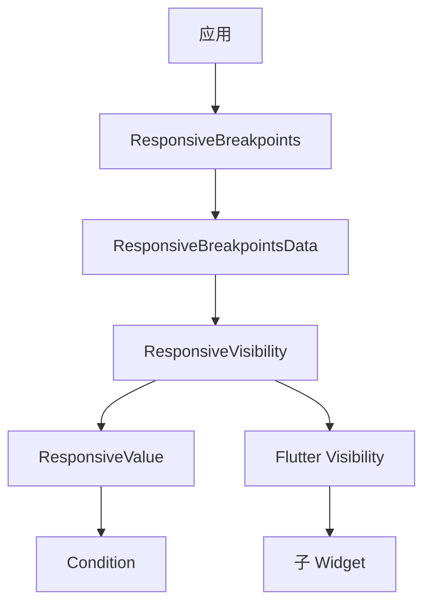

# ResponsiveVisibility 代码讲解

## 概述

`ResponsiveVisibility` 是响应式框架中用于控制 Widget 可见性的便捷包装器。它基于 Flutter 的 `Visibility` Widget，通过 `Condition` 和 `ResponsiveValue` 实现根据屏幕断点、设备类型等条件动态控制 Widget 的显示和隐藏。

### 核心职责

1. **响应式可见性控制**：根据屏幕尺寸、断点、设备类型等条件控制 Widget 的可见性
2. **条件管理**：支持通过 `visibleConditions` 和 `hiddenConditions` 定义显示和隐藏条件
3. **便捷包装**：简化 `Visibility` Widget 的使用，提供更直观的响应式 API
4. **状态维护**：支持维护 Widget 的状态、动画、尺寸等属性

### 在响应式框架中的位置

`ResponsiveVisibility` 位于响应式 Widget 层，依赖于核心响应式系统：



**数据流向**：

1. `ResponsiveBreakpoints` 提供响应式数据
2. `ResponsiveVisibility` 使用 `ResponsiveValue` 评估条件
3. `ResponsiveValue` 根据 `Condition` 列表选择活动条件
4. 最终通过 `Visibility` Widget 控制子 Widget 的可见性

### 与相关类的关系

- **Visibility**：Flutter 原生 Widget，提供基础的可见性控制功能
- **ResponsiveValue**：响应式值类，根据条件选择对应的值
- **Condition**：条件定义类，定义何时应用某个值
- **ResponsiveBreakpointsData**：响应式数据源，提供屏幕尺寸、断点等信息

## 类定义和特性

### 类声明

```dart
class ResponsiveVisibility extends StatelessWidget
```

`ResponsiveVisibility` 继承自 `StatelessWidget`，是一个无状态的 Widget。

**设计特点**：

- **无状态设计**：每次构建时重新计算可见性，确保响应式更新
- **便捷包装器**：封装了 `Visibility` 和 `ResponsiveValue` 的复杂逻辑
- **声明式 API**：通过条件列表声明式地定义可见性规则

## 属性详解

### child

```dart
final Widget child;
```

**作用**：要控制可见性的子 Widget。

**说明**：这是必需的参数，指定需要根据条件显示或隐藏的 Widget。

### visible

```dart
final bool visible;
```

**作用**：默认可见性值。

**说明**：

- 默认值为 `true`，表示 Widget 默认可见
- 当没有条件匹配时，使用此值
- 作为 `ResponsiveValue` 的 `defaultValue` 使用

**使用场景**：

- 默认显示，某些条件下隐藏
- 默认隐藏，某些条件下显示

### visibleConditions

```dart
final List<Condition<bool>> visibleConditions;
```

**作用**：定义 Widget 应该显示的条件列表。

**说明**：

- 类型为 `List<Condition<bool>>`，每个条件返回 `bool` 值
- 在 `build()` 方法中，这些条件会被转换为 `value: true` 的条件
- 当条件匹配时，Widget 会显示（`visible = true`）

**条件类型**：

- `Condition.equals`：当断点名称等于指定值时显示
- `Condition.largerThan`：当屏幕宽度大于指定值时显示
- `Condition.smallerThan`：当屏幕宽度小于指定值时显示
- `Condition.between`：当屏幕宽度在指定范围内时显示

**使用示例**：

```dart
ResponsiveVisibility(
  visibleConditions: [
    Condition.equals(name: DESKTOP),
    Condition.largerThan(name: TABLET),
  ],
  child: DesktopOnlyWidget(),
)
```

### hiddenConditions

```dart
final List<Condition<bool>> hiddenConditions;
```

**作用**：定义 Widget 应该隐藏的条件列表。

**说明**：

- 类型为 `List<Condition<bool>>`，每个条件返回 `bool` 值
- 在 `build()` 方法中，这些条件会被转换为 `value: false` 的条件
- 当条件匹配时，Widget 会隐藏（`visible = false`）

**优先级**：

- `hiddenConditions` 和 `visibleConditions` 会合并到一个条件列表中
- 如果多个条件匹配，`ResponsiveValue` 会根据优先级选择（EQUALS > BETWEEN > SMALLER_THAN > LARGER_THAN）
- 后添加的条件优先级更高（列表反转后遍历）

**使用示例**：

```dart
ResponsiveVisibility(
  hiddenConditions: [
    Condition.smallerThan(name: TABLET),
  ],
  child: TabletAndDesktopWidget(),
)
```

### replacement

```dart
final Widget replacement;
```

**作用**：当 Widget 隐藏时显示的替换 Widget。

**说明**：

- 默认值为 `const SizedBox.shrink()`（空 Widget，不占空间）
- 当 `visible = false` 时，`Visibility` 会显示此 Widget 而不是 `child`
- 可以用于占位符、加载指示器等场景

**使用示例**：

```dart
ResponsiveVisibility(
  hiddenConditions: [Condition.smallerThan(name: TABLET)],
  replacement: PlaceholderWidget(), // 自定义替换 Widget
  child: DesktopWidget(),
)
```

### maintainState

```dart
final bool maintainState;
```

**作用**：隐藏时是否维护 Widget 的状态。

**说明**：

- 传递给 `Visibility` Widget 的 `maintainState` 属性
- 当 `true` 时，即使 Widget 不可见，其状态也会保留
- 当 `false` 时，隐藏的 Widget 会被销毁，状态丢失

**使用场景**：

- 需要保留表单输入、滚动位置等状态时设为 `true`
- 需要释放资源、重置状态时设为 `false`

### maintainAnimation

```dart
final bool maintainAnimation;
```

**作用**：隐藏时是否维护 Widget 的动画。

**说明**：

- 传递给 `Visibility` Widget 的 `maintainAnimation` 属性
- 当 `true` 时，隐藏的 Widget 的动画会继续运行
- 当 `false` 时，动画会停止

**使用场景**：

- 需要动画在后台继续运行时设为 `true`
- 需要停止动画以节省资源时设为 `false`

### maintainSize

```dart
final bool maintainSize;
```

**作用**：隐藏时是否维护 Widget 的尺寸。

**说明**：

- 传递给 `Visibility` Widget 的 `maintainSize` 属性
- 当 `true` 时，隐藏的 Widget 仍会占据布局空间
- 当 `false` 时，隐藏的 Widget 不占据空间

**使用场景**：

- 需要保持布局稳定、避免跳动时设为 `true`
- 需要完全隐藏、释放空间时设为 `false`

### maintainSemantics

```dart
final bool maintainSemantics;
```

**作用**：隐藏时是否维护 Widget 的语义信息。

**说明**：

- 传递给 `Visibility` Widget 的 `maintainSemantics` 属性
- 当 `true` 时，隐藏的 Widget 的语义信息仍可被辅助功能工具访问
- 当 `false` 时，语义信息会被隐藏

**使用场景**：

- 需要辅助功能工具访问隐藏内容时设为 `true`
- 需要完全隐藏语义信息时设为 `false`

### maintainInteractivity

```dart
final bool maintainInteractivity;
```

**作用**：隐藏时是否维护 Widget 的交互性。

**说明**：

- 传递给 `Visibility` Widget 的 `maintainInteractivity` 属性
- 当 `true` 时，隐藏的 Widget 仍可接收触摸事件
- 当 `false` 时，隐藏的 Widget 不能接收触摸事件

**使用场景**：

- 需要隐藏但仍可交互时设为 `true`（如透明按钮）
- 需要完全禁用交互时设为 `false`

## 构造函数

```dart
const ResponsiveVisibility({
  super.key,
  required this.child,
  this.visible = true,
  this.visibleConditions = const [],
  this.hiddenConditions = const [],
  this.replacement = const SizedBox.shrink(),
  this.maintainState = false,
  this.maintainAnimation = false,
  this.maintainSize = false,
  this.maintainSemantics = false,
  this.maintainInteractivity = false,
});
```

**参数说明**：

- `key`：Widget 的键，用于 Widget 树中的识别
- `child`：必需的子 Widget
- `visible`：默认可见性，默认为 `true`
- `visibleConditions`：显示条件列表，默认为空列表
- `hiddenConditions`：隐藏条件列表，默认为空列表
- `replacement`：替换 Widget，默认为 `SizedBox.shrink()`
- `maintainState`：是否维护状态，默认为 `false`
- `maintainAnimation`：是否维护动画，默认为 `false`
- `maintainSize`：是否维护尺寸，默认为 `false`
- `maintainSemantics`：是否维护语义，默认为 `false`
- `maintainInteractivity`：是否维护交互性，默认为 `false`

**设计特点**：

- 所有参数都有合理的默认值
- 使用 `const` 构造函数，支持编译时常量
- 参数命名清晰，易于理解

## build() 方法详解

```dart
@override
Widget build(BuildContext context) {
  // Initialize mutable value holders.
  List<Condition<bool>> conditions = [];
  bool visibleValue = visible;

  // Combine Conditions.
  conditions.addAll(visibleConditions.map((e) => e.copyWith(value: true)));
  conditions.addAll(hiddenConditions.map((e) => e.copyWith(value: false)));
  // Get visible value from active condition.
  visibleValue = ResponsiveValue<bool>(context,
          defaultValue: visibleValue, conditionalValues: conditions)
      .value;

  return Visibility(
    replacement: replacement,
    visible: visibleValue,
    maintainState: maintainState,
    maintainAnimation: maintainAnimation,
    maintainSize: maintainSize,
    maintainSemantics: maintainSemantics,
    maintainInteractivity: maintainInteractivity,
    child: child,
  );
}
```

### 实现逻辑

1. **初始化变量**：
   - 创建空的条件列表
   - 使用 `visible` 作为默认可见性值

2. **合并条件**：
   - 将 `visibleConditions` 中的条件转换为 `value: true` 的条件
   - 将 `hiddenConditions` 中的条件转换为 `value: false` 的条件
   - 合并到同一个条件列表中

3. **计算可见性**：
   - 创建 `ResponsiveValue<bool>` 实例
   - 传入默认值和条件列表
   - 获取活动条件的值作为最终可见性

4. **创建 Visibility Widget**：
   - 使用计算得到的 `visibleValue`
   - 传递所有维护选项
   - 返回 `Visibility` Widget

### 条件转换逻辑

**visibleConditions 转换**：

```dart
conditions.addAll(visibleConditions.map((e) => e.copyWith(value: true)));
```

- 每个条件通过 `copyWith(value: true)` 创建新条件
- 保持原有的条件类型（equals、largerThan 等）和参数
- 将值设置为 `true`（表示显示）

**hiddenConditions 转换**：

```dart
conditions.addAll(hiddenConditions.map((e) => e.copyWith(value: false)));
```

- 每个条件通过 `copyWith(value: false)` 创建新条件
- 保持原有的条件类型和参数
- 将值设置为 `false`（表示隐藏）

### ResponsiveValue 的使用

`ResponsiveValue` 会根据以下优先级选择活动条件：

1. **EQUALS**：精确匹配断点名称
2. **BETWEEN**：屏幕宽度在范围内
3. **SMALLER_THAN**：屏幕宽度小于指定值
4. **LARGER_THAN**：屏幕宽度大于指定值

如果多个条件匹配，选择优先级最高的。如果列表中有多个相同优先级的条件，后添加的（在列表中靠后的）会被优先选择（因为列表会反转遍历）。

## 使用示例

### 基本使用

```dart
ResponsiveVisibility(
  child: Text('这个 Widget 默认可见'),
)
```

### 根据设备类型显示

```dart
ResponsiveVisibility(
  visibleConditions: [
    Condition.equals(name: DESKTOP),
  ],
  child: DesktopOnlyWidget(),
)
```

### 根据屏幕尺寸显示

```dart
ResponsiveVisibility(
  visibleConditions: [
    Condition.largerThan(breakpoint: 800),
  ],
  child: WideScreenWidget(),
)
```

### 根据屏幕尺寸隐藏

```dart
ResponsiveVisibility(
  hiddenConditions: [
    Condition.smallerThan(name: TABLET),
  ],
  child: TabletAndDesktopWidget(),
)
```

### 组合多个条件

```dart
ResponsiveVisibility(
  visibleConditions: [
    Condition.equals(name: DESKTOP),
    Condition.largerThan(name: TABLET),
  ],
  hiddenConditions: [
    Condition.smallerThan(breakpoint: 400),
  ],
  child: AdaptiveWidget(),
)
```

### 使用替换 Widget

```dart
ResponsiveVisibility(
  hiddenConditions: [
    Condition.smallerThan(name: TABLET),
  ],
  replacement: Center(
    child: Text('此内容在移动设备上不可用'),
  ),
  child: DesktopFeature(),
)
```

### 维护状态

```dart
ResponsiveVisibility(
  visibleConditions: [
    Condition.equals(name: DESKTOP),
  ],
  maintainState: true, // 隐藏时保留状态
  maintainSize: true,  // 隐藏时保留尺寸
  child: FormWidget(), // 表单输入会被保留
)
```

### 横竖屏不同显示

```dart
ResponsiveVisibility(
  visibleConditions: [
    Condition.equals(
      name: TABLET,
      value: true,
      landscapeValue: false, // 横屏时隐藏
    ),
  ],
  child: PortraitOnlyWidget(),
)
```

### 复杂条件组合

```dart
ResponsiveVisibility(
  visibleConditions: [
    // 桌面设备显示
    Condition.equals(name: DESKTOP),
    // 或屏幕宽度大于 1200
    Condition.largerThan(breakpoint: 1200),
  ],
  hiddenConditions: [
    // 但移动设备隐藏
    Condition.smallerThan(name: TABLET),
  ],
  child: ComplexWidget(),
)
```

### 响应式导航栏

```dart
ResponsiveVisibility(
  hiddenConditions: [
    Condition.smallerThan(name: TABLET),
  ],
  replacement: IconButton(
    icon: Icon(Icons.menu),
    onPressed: () => _openDrawer(),
  ),
  child: NavigationBar(), // 桌面显示完整导航栏
)
```

### 响应式侧边栏

```dart
ResponsiveVisibility(
  visibleConditions: [
    Condition.largerThan(name: TABLET),
  ],
  maintainSize: true, // 保持布局稳定
  child: Sidebar(),
)
```

## 设计模式和最佳实践

### 包装器模式

`ResponsiveVisibility` 采用了包装器模式：

- **封装复杂性**：隐藏了 `ResponsiveValue` 和条件管理的复杂性
- **简化 API**：提供更直观的 `visibleConditions` 和 `hiddenConditions` 参数
- **保持兼容性**：完全兼容 `Visibility` Widget 的所有功能

### 条件值模式

通过 `ResponsiveValue` 实现条件值模式：

- **声明式定义**：通过条件列表声明式地定义可见性规则
- **自动评估**：框架自动评估条件并选择活动值
- **响应式更新**：当屏幕尺寸变化时自动重新评估

### 最佳实践建议

1. **优先使用设备类型**：使用 `Condition.equals(name: DESKTOP)` 而非具体的像素值，提高可维护性

2. **合理使用默认值**：通过 `visible` 参数设置合理的默认可见性

3. **条件优先级**：理解条件的优先级，合理组织条件列表

4. **性能考虑**：
   - `maintainState: true` 会保留 Widget 树，增加内存使用
   - `maintainSize: true` 会保留布局空间，可能影响布局
   - 根据实际需求选择合适的维护选项

5. **可访问性**：考虑使用 `maintainSemantics` 确保辅助功能工具可以访问隐藏内容

6. **测试场景**：在不同屏幕尺寸和设备类型上测试可见性逻辑

7. **条件组合**：避免过于复杂的条件组合，保持代码可读性

## 常见使用场景

### 场景 1：桌面专用功能

```dart
ResponsiveVisibility(
  visibleConditions: [
    Condition.equals(name: DESKTOP),
  ],
  child: DesktopOnlyFeature(),
)
```

### 场景 2：移动端隐藏复杂 UI

```dart
ResponsiveVisibility(
  hiddenConditions: [
    Condition.smallerThan(name: TABLET),
  ],
  child: ComplexDashboard(),
)
```

### 场景 3：响应式导航

```dart
Row(
  children: [
    // 移动端显示菜单按钮
    ResponsiveVisibility(
      visibleConditions: [
        Condition.smallerThan(name: TABLET),
      ],
      child: MenuButton(),
    ),
    // 桌面端显示完整导航
    ResponsiveVisibility(
      visibleConditions: [
        Condition.largerOrEqualTo(name: TABLET),
      ],
      child: NavigationBar(),
    ),
  ],
)
```

### 场景 4：条件替换内容

```dart
ResponsiveVisibility(
  hiddenConditions: [
    Condition.smallerThan(name: TABLET),
  ],
  replacement: CompactVersion(),
  child: FullVersion(),
)
```

## 总结

`ResponsiveVisibility` 是响应式框架中用于控制 Widget 可见性的便捷工具，提供了：

1. **声明式 API**：通过条件列表声明式地定义可见性规则
2. **灵活的条件系统**：支持多种条件类型和组合
3. **完整的 Visibility 功能**：支持所有 `Visibility` Widget 的维护选项
4. **响应式更新**：自动响应屏幕尺寸变化
5. **易于使用**：简化的 API，降低使用复杂度

理解 `ResponsiveVisibility` 的设计和使用方法，有助于更好地构建响应式 Flutter 应用，实现根据设备类型和屏幕尺寸动态调整 UI 的功能。
